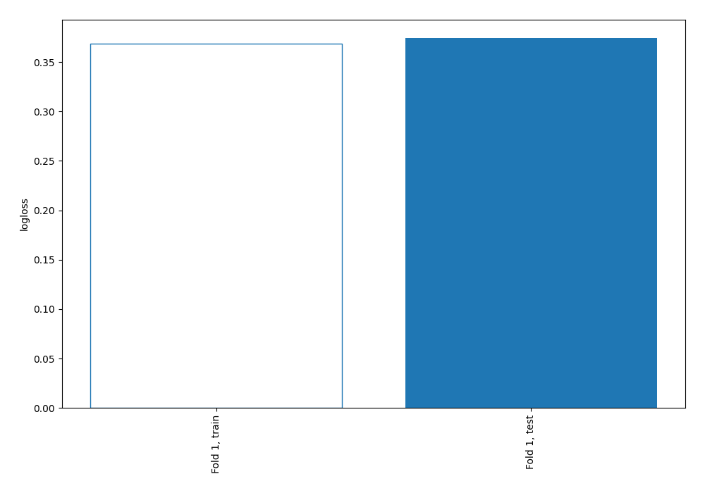
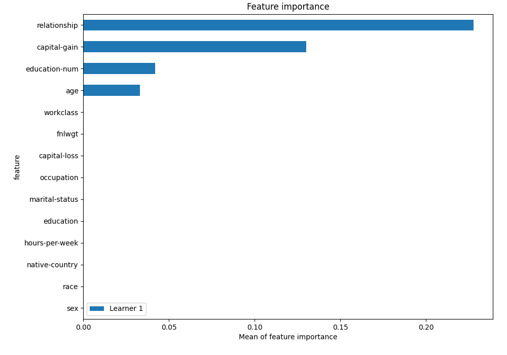
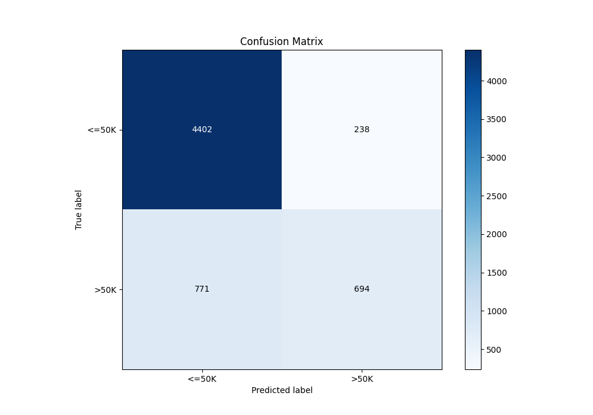
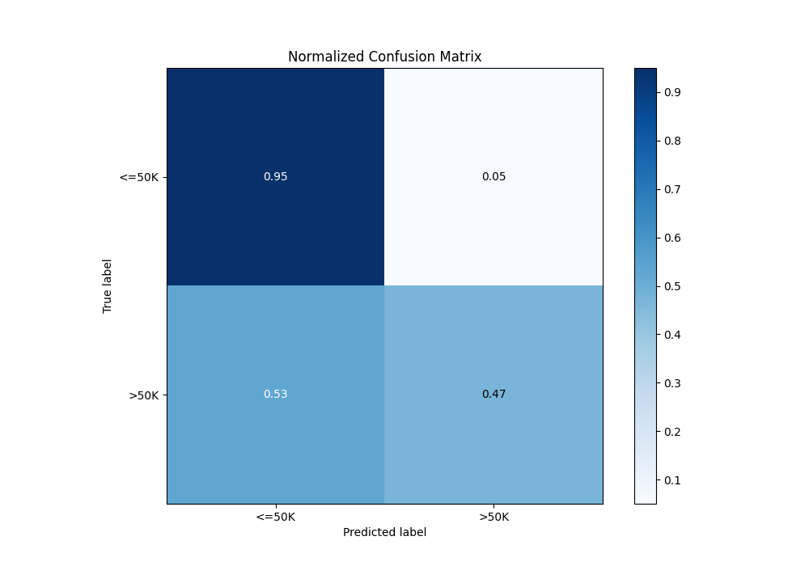
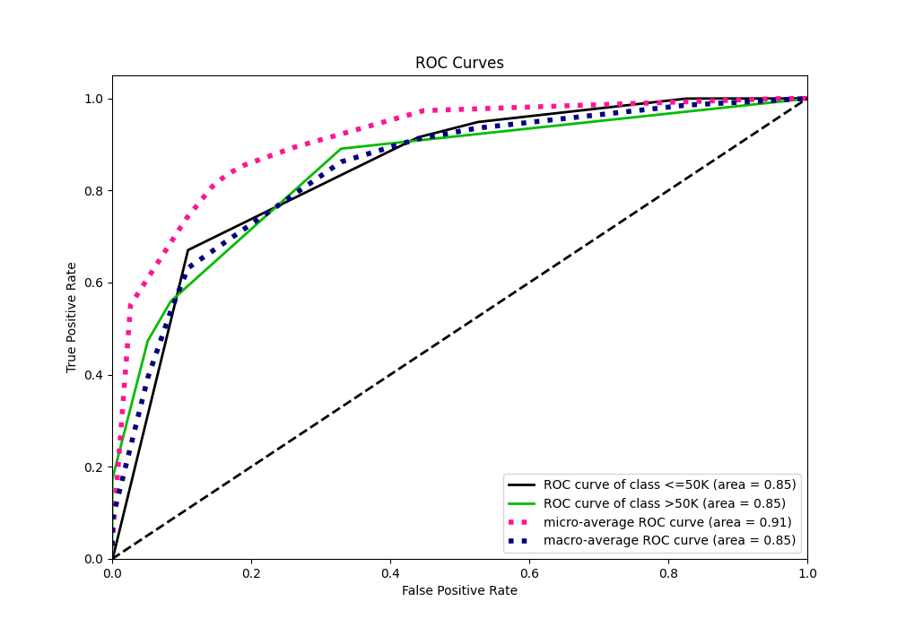
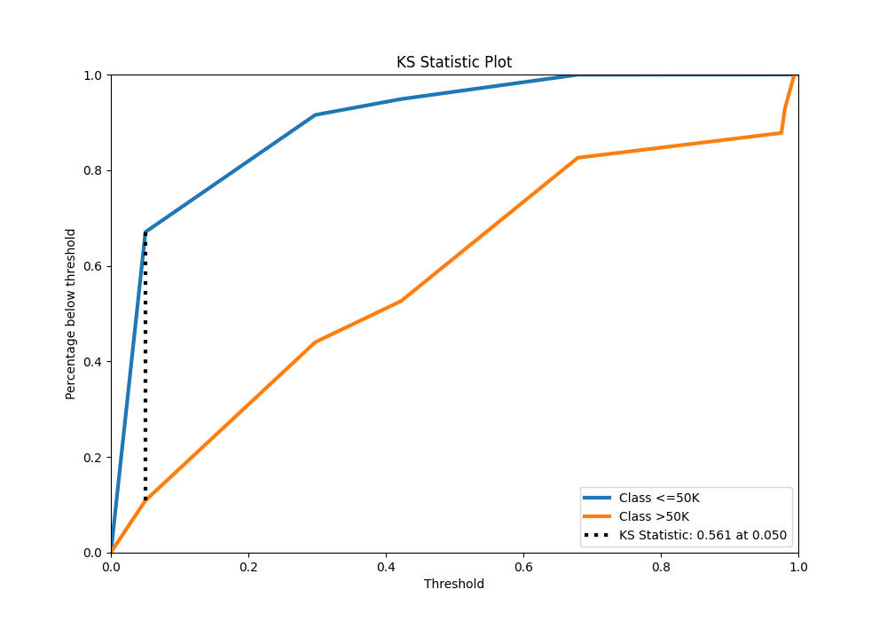
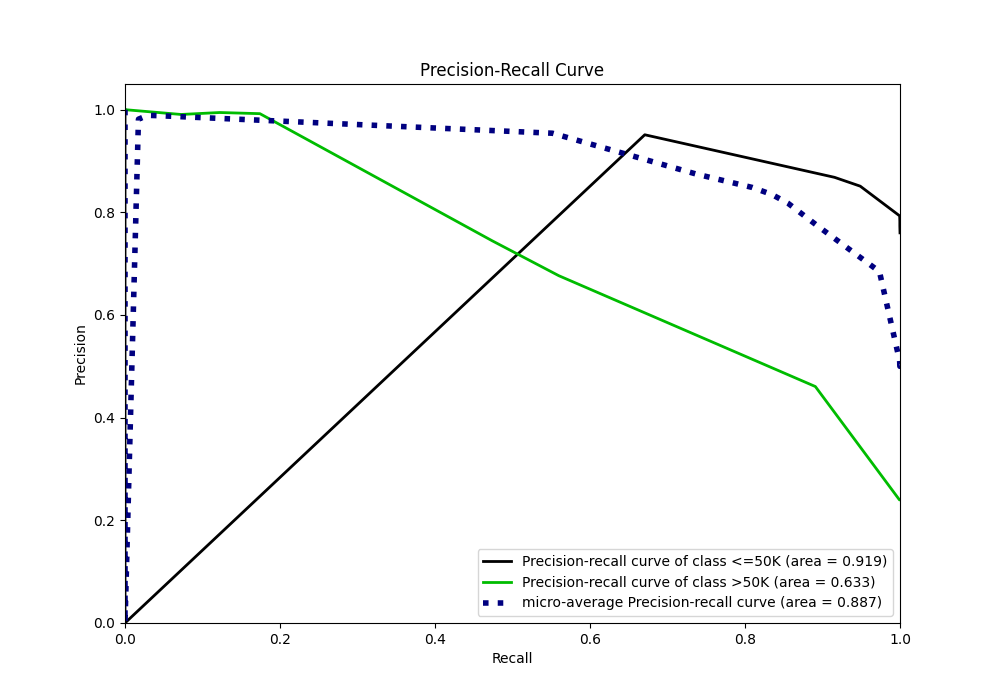
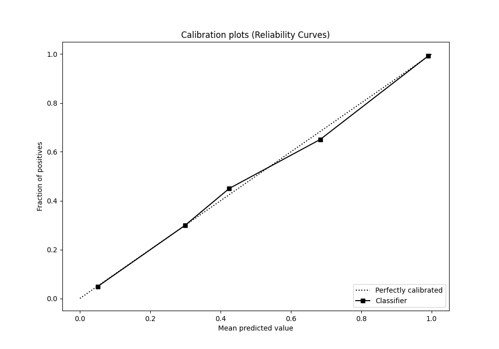
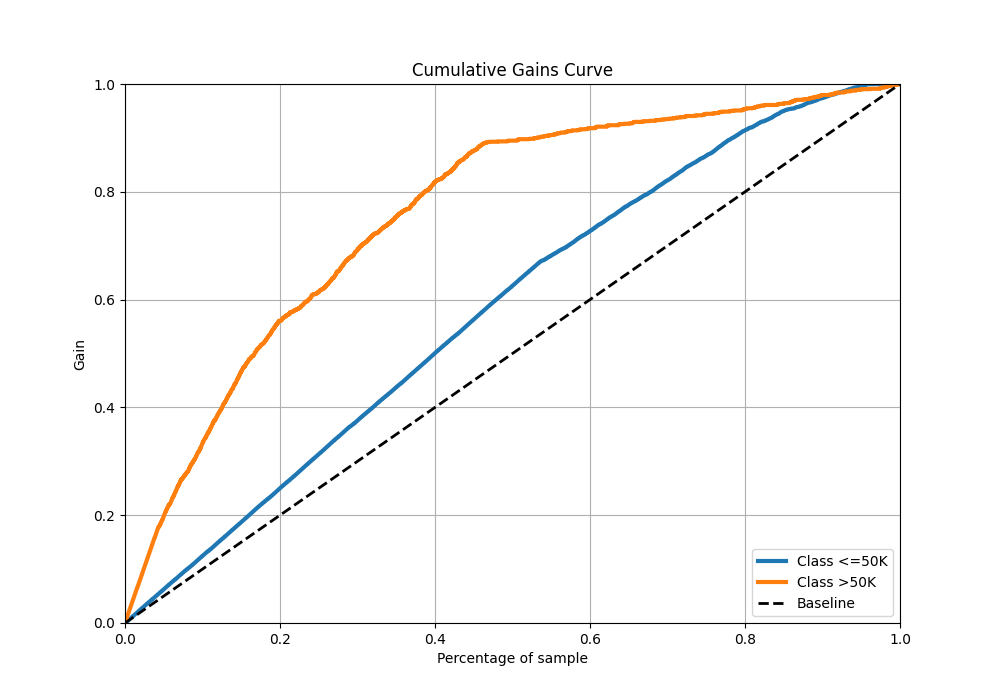
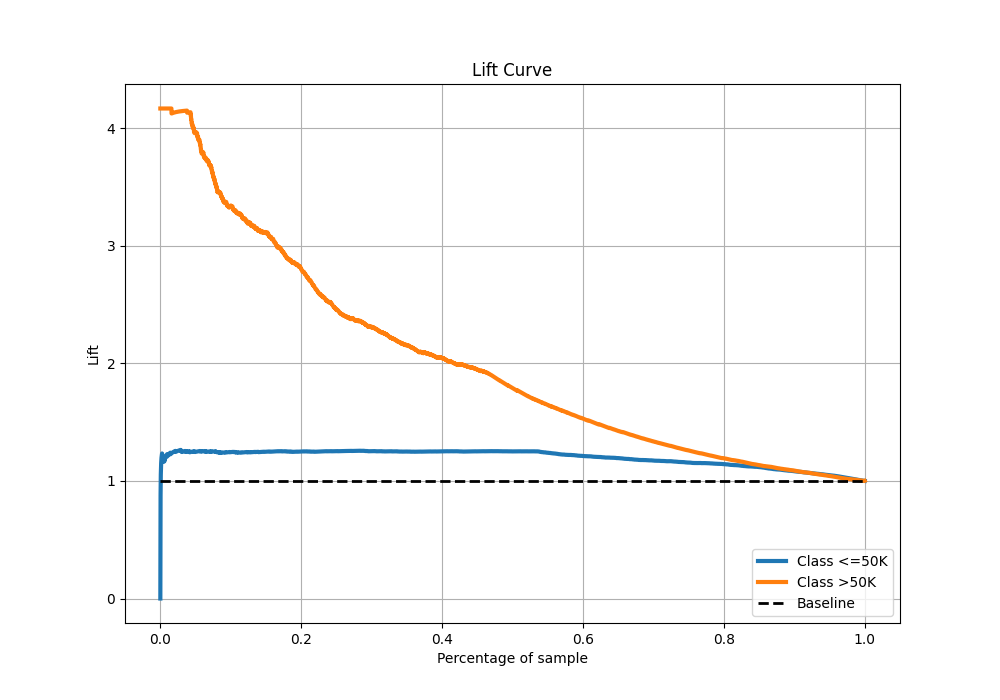

# Summary of 2_DecisionTree

[<< Go back](../README.md)

## Decision Tree
- **n_jobs**: -1
- **criterion**: gini
- **max_depth**: 3
- **explain_level**: 2

## Validation
 - **validation_type**: split
 - **train_ratio**: 0.75
 - **shuffle**: True
 - **stratify**: True

## Optimized metric
logloss

## Training time

10.5 seconds

## Metric details
|           |    score |   threshold |
|:----------|---------:|------------:|
| logloss   | 0.374302 |  nan        |
| auc       | 0.845062 |  nan        |
| f1        | 0.612626 |    0.297358 |
| accuracy  | 0.834726 |    0.422222 |
| precision | 0.994444 |    0.97551  |
| recall    | 0.999317 |    0        |
| mcc       | 0.50881  |    0.297358 |

## Metric details with threshold from accuracy metric
|           |    score |   threshold |
|:----------|---------:|------------:|
| logloss   | 0.374302 |  nan        |
| auc       | 0.845062 |  nan        |
| f1        | 0.579057 |    0.422222 |
| accuracy  | 0.834726 |    0.422222 |
| precision | 0.744635 |    0.422222 |
| recall    | 0.47372  |    0.422222 |
| mcc       | 0.501592 |    0.422222 |

## Confusion matrix (at threshold=0.422222)
|                  |   Predicted as <=50K |   Predicted as >50K |
|:-----------------|---------------------:|--------------------:|
| Labeled as <=50K |                 4402 |                 238 |
| Labeled as >50K  |                  771 |                 694 |

## Learning curves

## Permutation-based Importance

## Confusion Matrix

## Normalized Confusion Matrix

## ROC Curve

## Kolmogorov-Smirnov Statistic

## Precision-Recall Curve

## Calibration Curve

## Cumulative Gains Curve

## Lift Curve

[<< Go back](../README.md)
