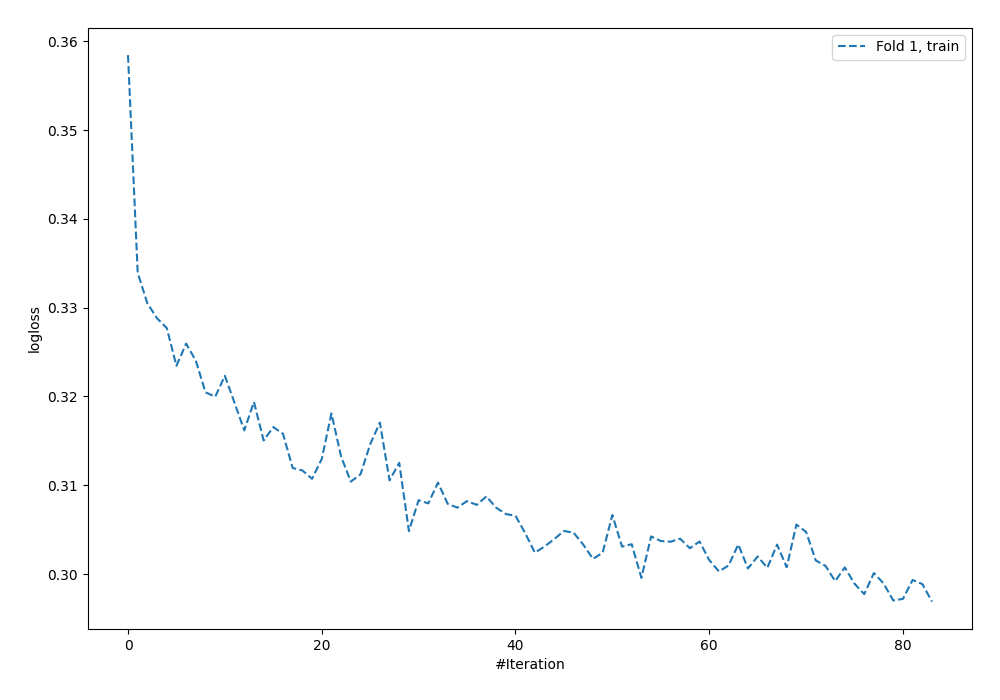
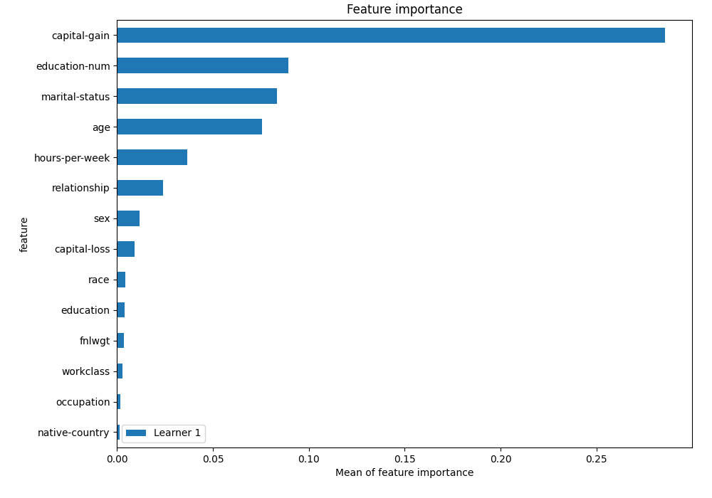
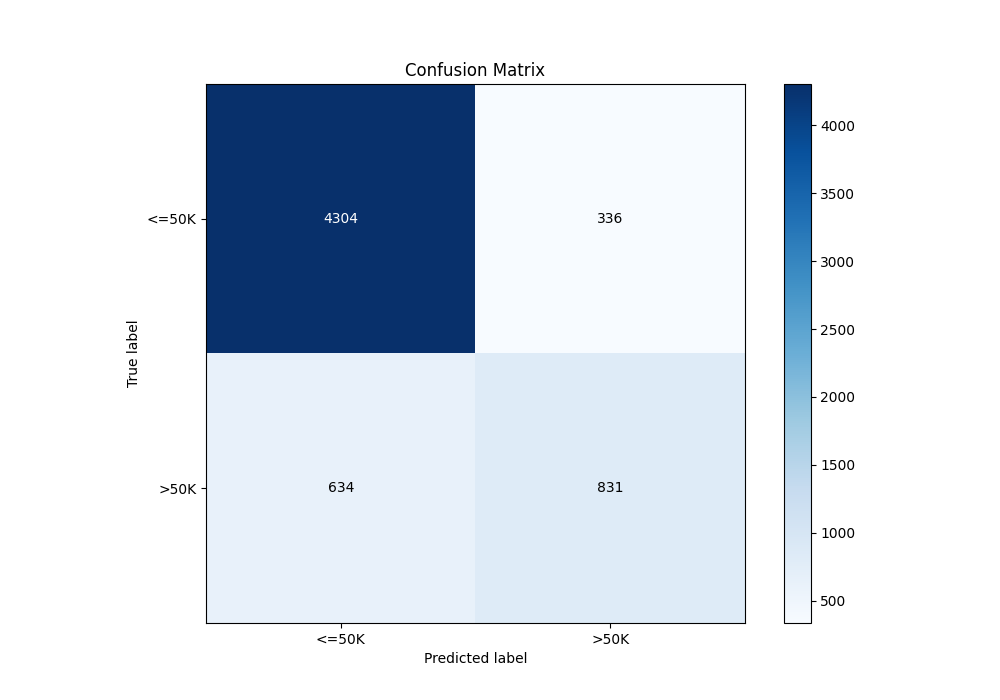
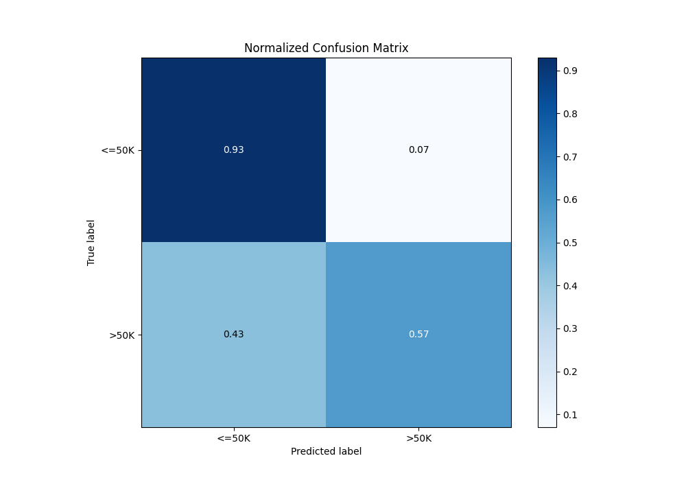
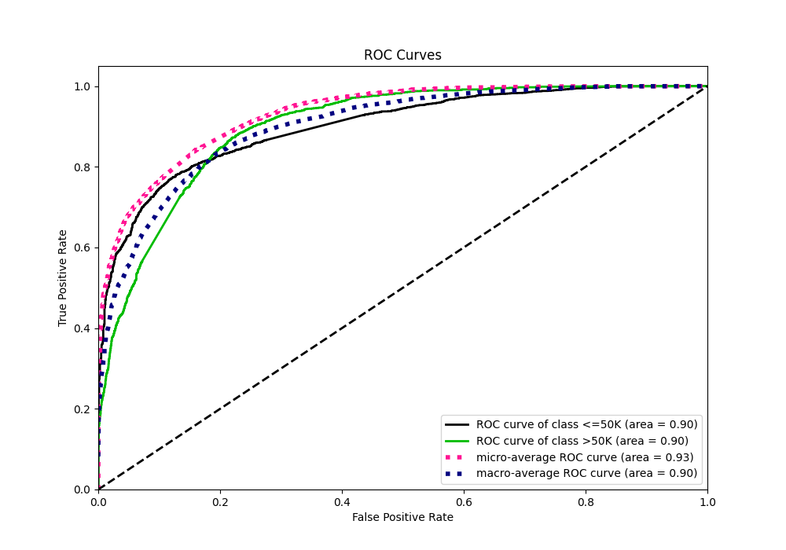
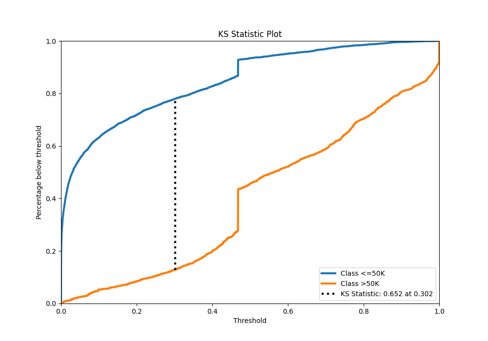
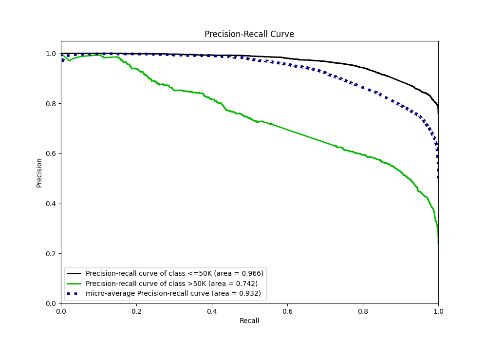
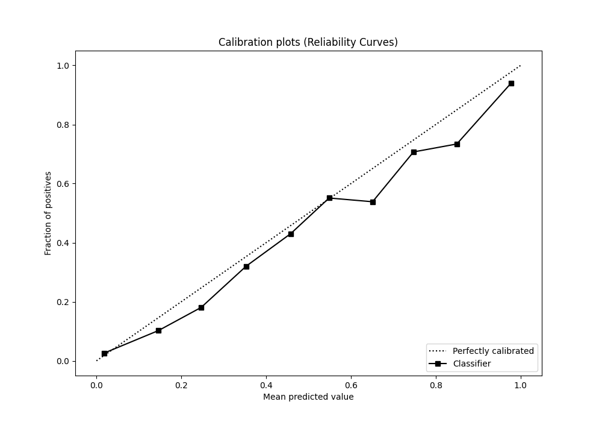
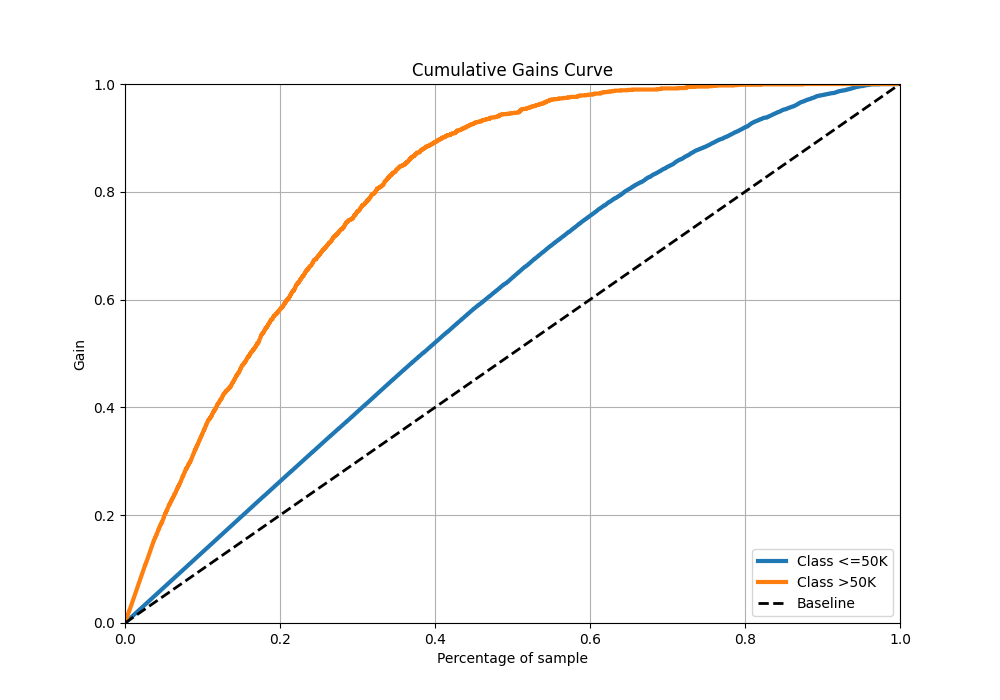
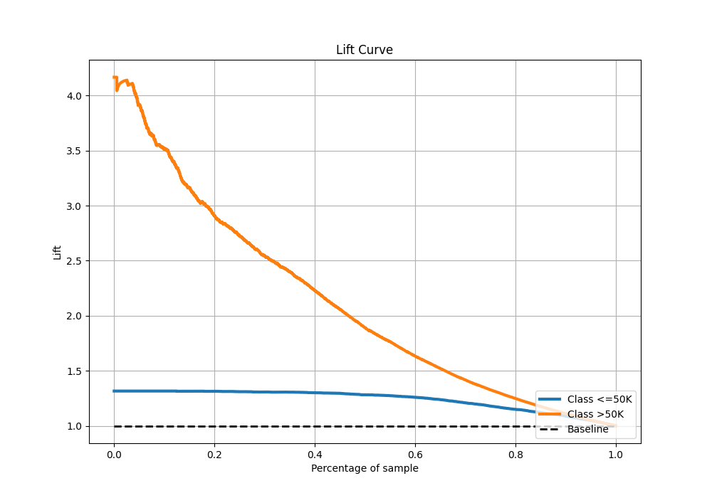

# Summary of 4_Default_NeuralNetwork

[<< Go back](../README.md)

## Neural Network
- **n_jobs**: -1
- **dense_1_size**: 32
- **dense_2_size**: 16
- **learning_rate**: 0.05
- **explain_level**: 2

## Validation
 - **validation_type**: split
 - **train_ratio**: 0.75
 - **shuffle**: True
 - **stratify**: True

## Optimized metric
logloss

## Training time

7.3 seconds

## Metric details
|           |    score |     threshold |
|:----------|---------:|--------------:|
| logloss   | 0.331937 | nan           |
| auc       | 0.900585 | nan           |
| f1        | 0.684166 |   0.37237     |
| accuracy  | 0.841114 |   0.468224    |
| precision | 0.992063 |   0.99842     |
| recall    | 1        |   3.26373e-09 |
| mcc       | 0.577803 |   0.353975    |

## Metric details with threshold from accuracy metric
|           |    score |   threshold |
|:----------|---------:|------------:|
| logloss   | 0.331937 |  nan        |
| auc       | 0.900585 |  nan        |
| f1        | 0.631459 |    0.468224 |
| accuracy  | 0.841114 |    0.468224 |
| precision | 0.712082 |    0.468224 |
| recall    | 0.567235 |    0.468224 |
| mcc       | 0.537422 |    0.468224 |

## Confusion matrix (at threshold=0.468224)
|                  |   Predicted as <=50K |   Predicted as >50K |
|:-----------------|---------------------:|--------------------:|
| Labeled as <=50K |                 4304 |                 336 |
| Labeled as >50K  |                  634 |                 831 |

## Learning curves

## Permutation-based Importance

## Confusion Matrix

## Normalized Confusion Matrix

## ROC Curve

## Kolmogorov-Smirnov Statistic

## Precision-Recall Curve

## Calibration Curve

## Cumulative Gains Curve

## Lift Curve

[<< Go back](../README.md)
