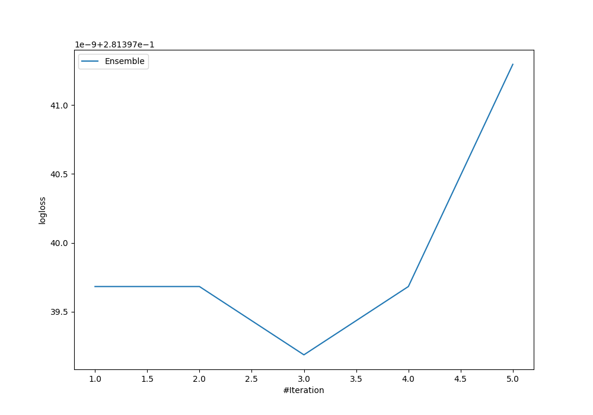
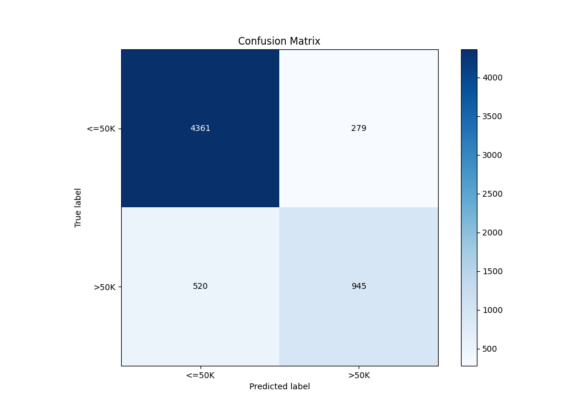
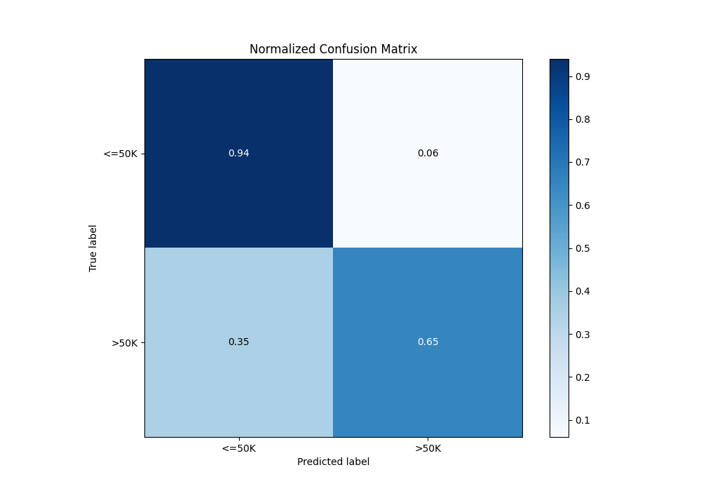
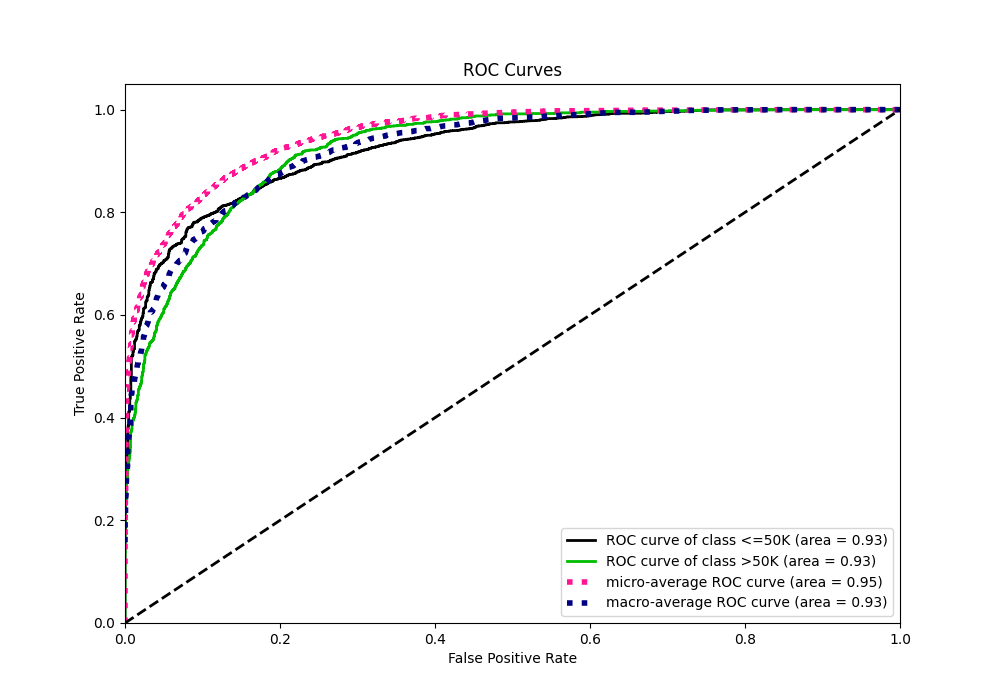
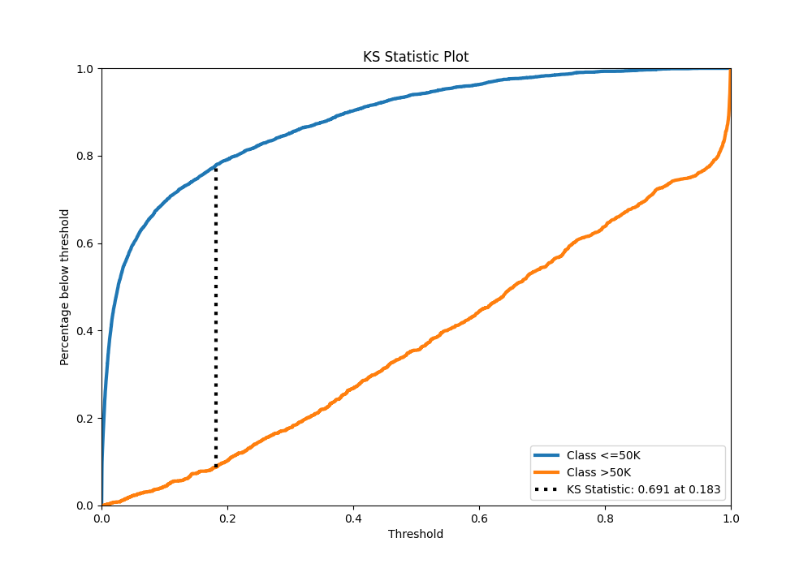
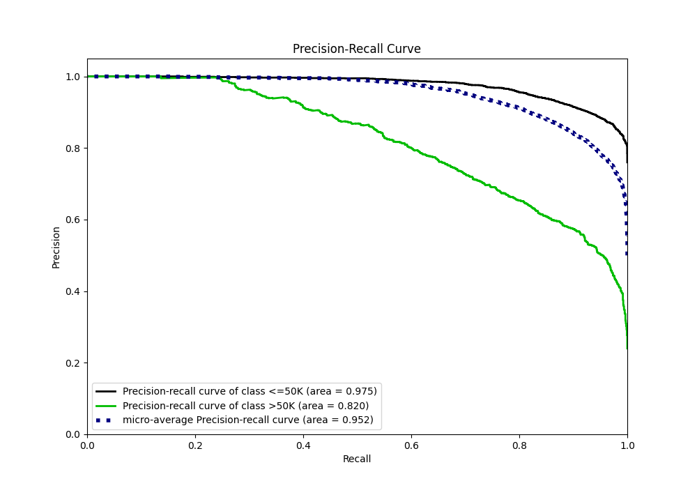
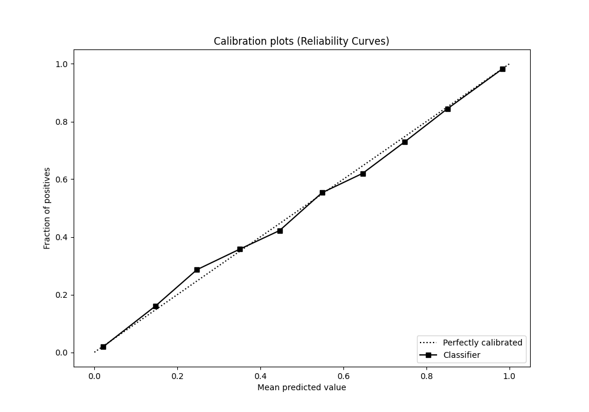
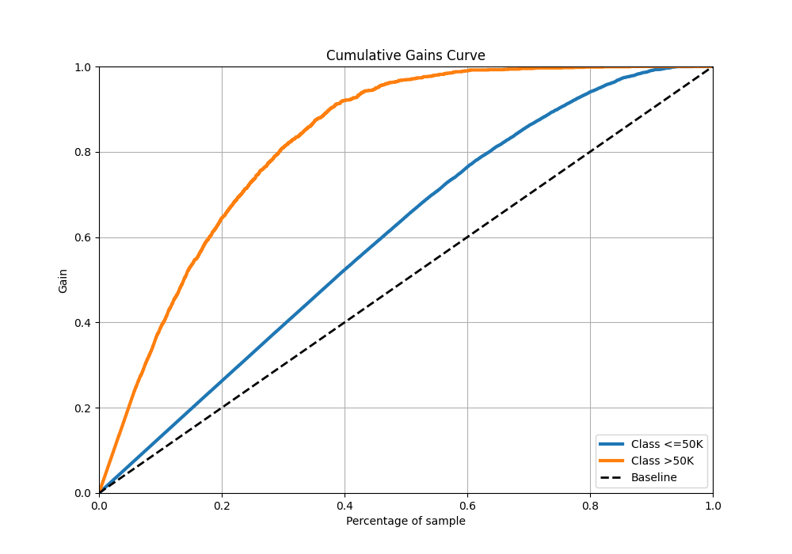
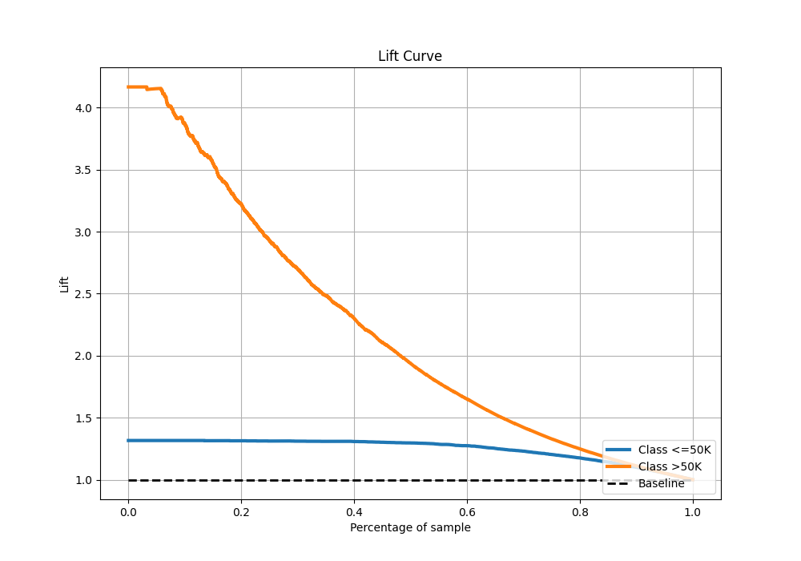

# Summary of Ensemble

[<< Go back](../README.md)

## Ensemble structure
| Model             |   Weight |
|:------------------|---------:|
| 3_Default_Xgboost |        3 |

## Metric details
|           |    score |     threshold |
|:----------|---------:|--------------:|
| logloss   | 0.281397 | nan           |
| auc       | 0.926382 | nan           |
| f1        | 0.719476 |   0.38146     |
| accuracy  | 0.869124 |   0.498272    |
| precision | 1        |   0.995149    |
| recall    | 1        |   5.43766e-05 |
| mcc       | 0.627008 |   0.38146     |

## Metric details with threshold from accuracy metric
|           |    score |   threshold |
|:----------|---------:|------------:|
| logloss   | 0.281397 |  nan        |
| auc       | 0.926382 |  nan        |
| f1        | 0.702864 |    0.498272 |
| accuracy  | 0.869124 |    0.498272 |
| precision | 0.772059 |    0.498272 |
| recall    | 0.645051 |    0.498272 |
| mcc       | 0.623922 |    0.498272 |

## Confusion matrix (at threshold=0.498272)
|                  |   Predicted as <=50K |   Predicted as >50K |
|:-----------------|---------------------:|--------------------:|
| Labeled as <=50K |                 4361 |                 279 |
| Labeled as >50K  |                  520 |                 945 |

## Learning curves

## Confusion Matrix

## Normalized Confusion Matrix

## ROC Curve

## Kolmogorov-Smirnov Statistic

## Precision-Recall Curve

## Calibration Curve

## Cumulative Gains Curve

## Lift Curve

[<< Go back](../README.md)
