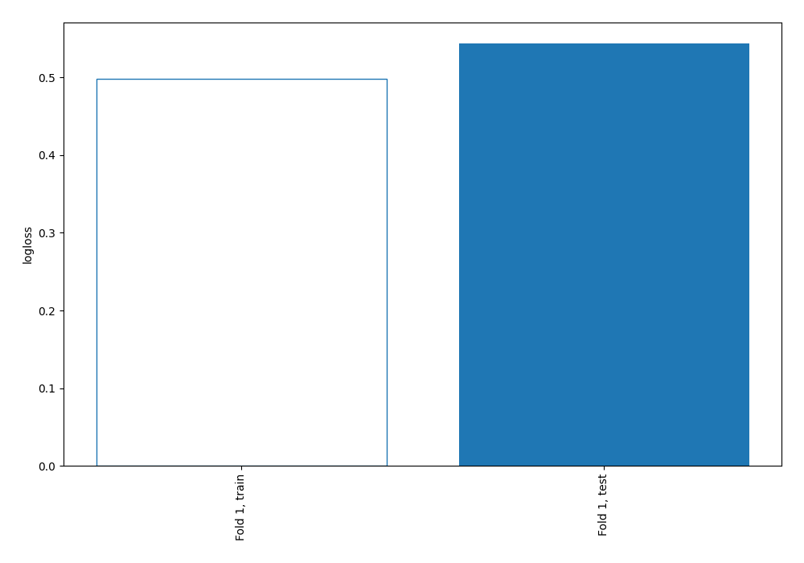
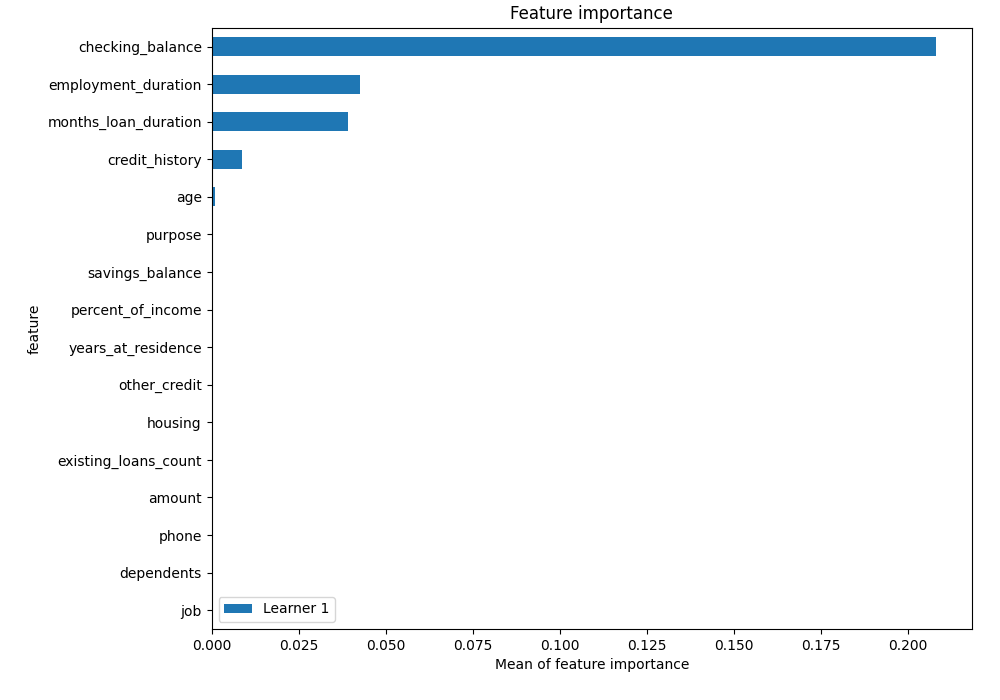
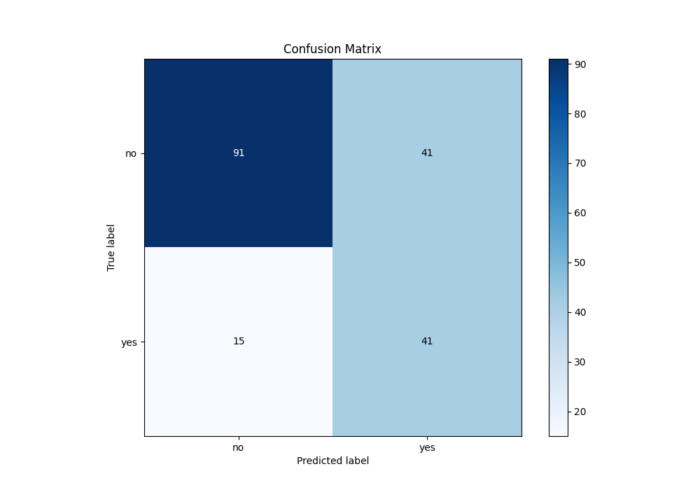
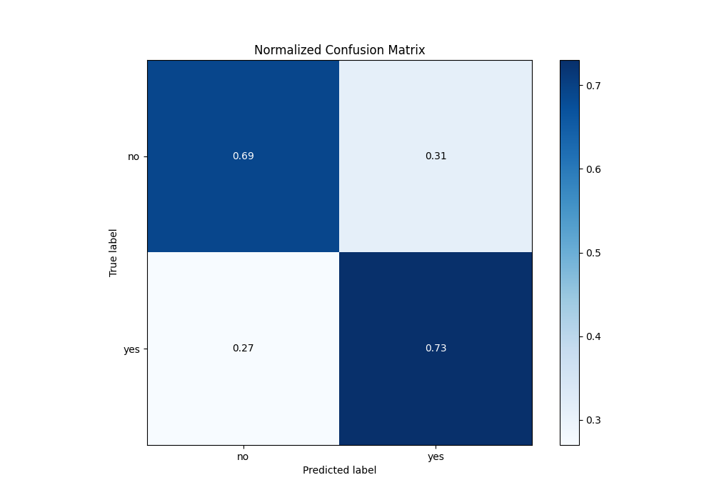
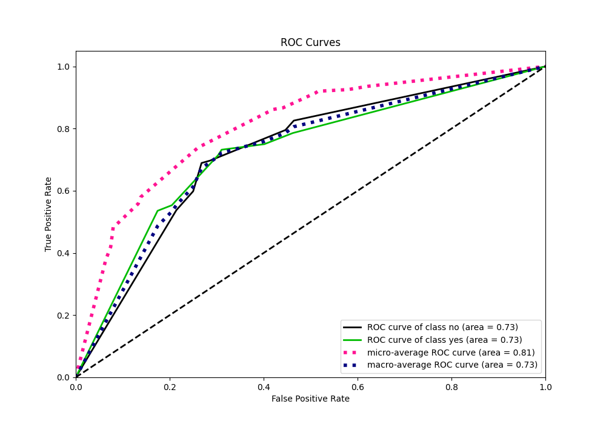
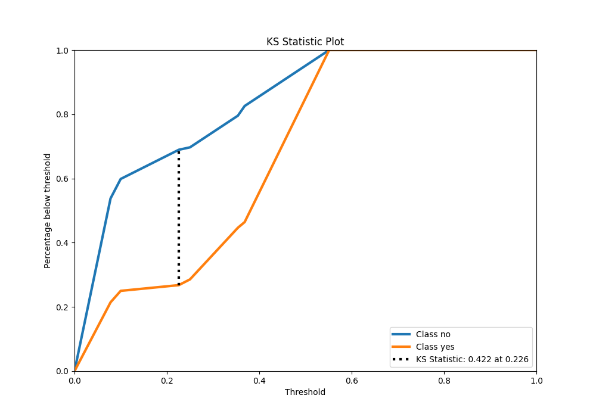
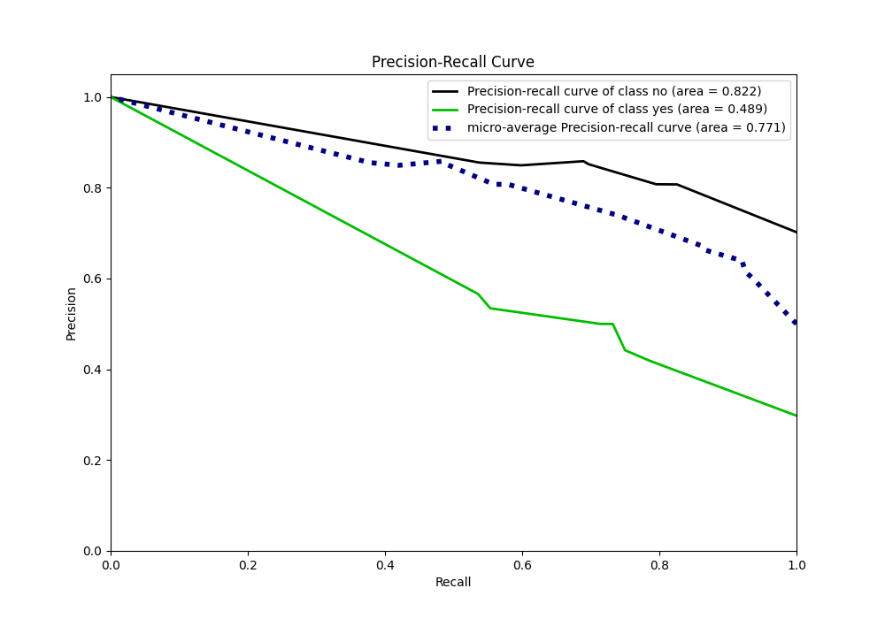
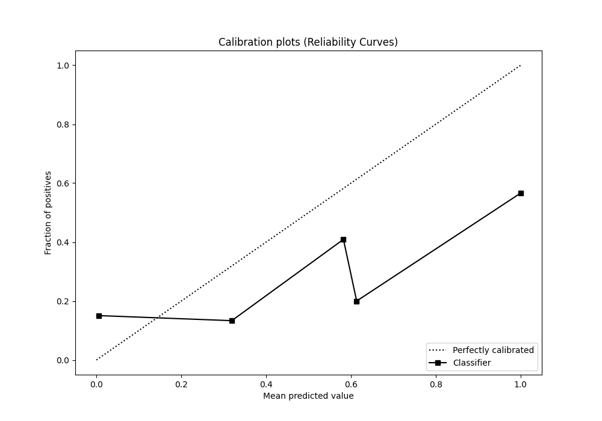
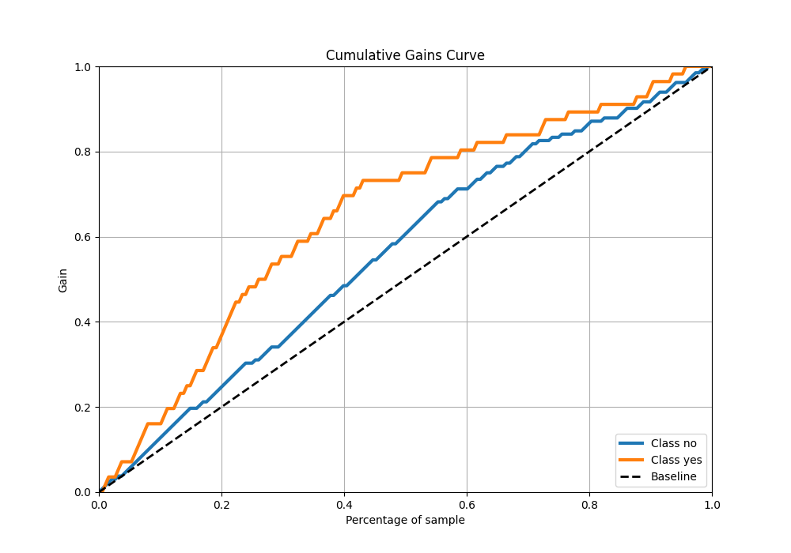
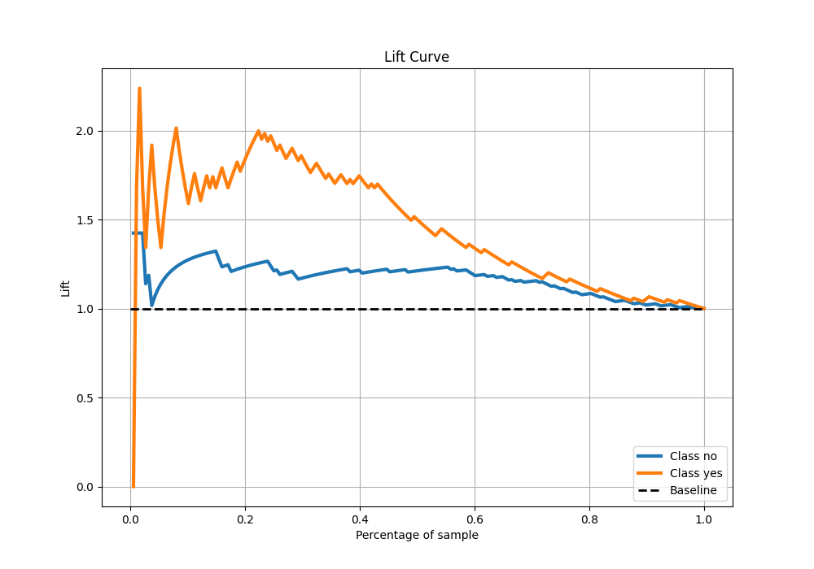

# Summary of 2_DecisionTree

[<< Go back](../README.md)

## Decision Tree
- **n_jobs**: -1
- **criterion**: gini
- **max_depth**: 3
- **explain_level**: 2

## Validation
 - **validation_type**: split
 - **train_ratio**: 0.75
 - **shuffle**: True
 - **stratify**: True

## Optimized metric
logloss

## Training time

2.9 seconds

## Metric details
|           |    score |   threshold |
|:----------|---------:|------------:|
| logloss   | 0.54371  | nan         |
| auc       | 0.725244 | nan         |
| f1        | 0.594203 |   0.225806  |
| accuracy  | 0.702128 |   0.225806  |
| precision | 0.5      |   0.225806  |
| recall    | 1        |   0.0702439 |
| mcc       | 0.388738 |   0.225806  |

## Metric details with threshold from accuracy metric
|           |    score |   threshold |
|:----------|---------:|------------:|
| logloss   | 0.54371  |  nan        |
| auc       | 0.725244 |  nan        |
| f1        | 0.594203 |    0.225806 |
| accuracy  | 0.702128 |    0.225806 |
| precision | 0.5      |    0.225806 |
| recall    | 0.732143 |    0.225806 |
| mcc       | 0.388738 |    0.225806 |

## Confusion matrix (at threshold=0.225806)
|                |   Predicted as no |   Predicted as yes |
|:---------------|------------------:|-------------------:|
| Labeled as no  |                91 |                 41 |
| Labeled as yes |                15 |                 41 |

## Learning curves

## Permutation-based Importance

## Confusion Matrix

## Normalized Confusion Matrix

## ROC Curve

## Kolmogorov-Smirnov Statistic

## Precision-Recall Curve

## Calibration Curve

## Cumulative Gains Curve

## Lift Curve

[<< Go back](../README.md)
