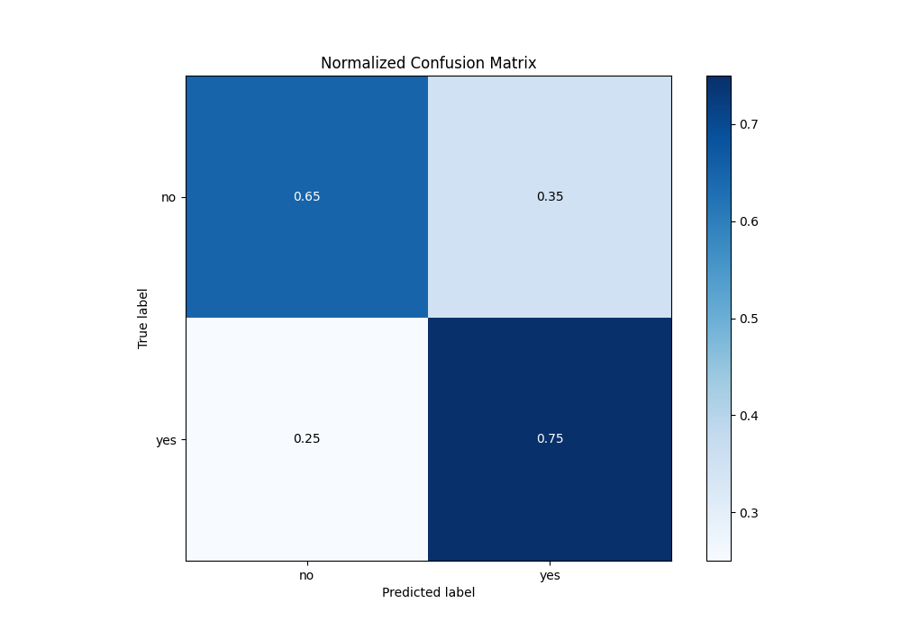
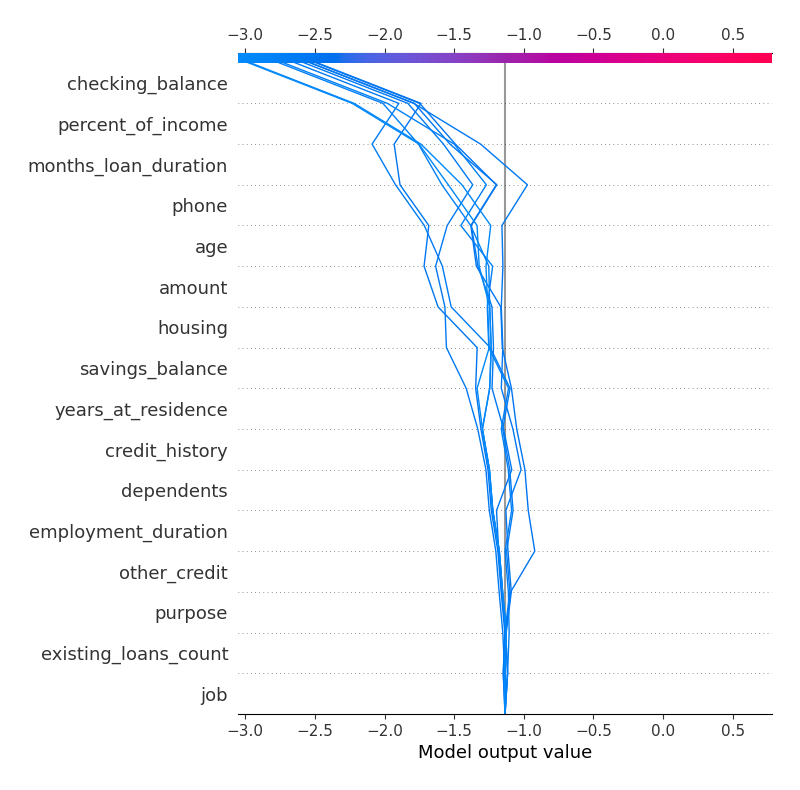

# Summary of 3_Linear

[<< Go back](../README.md)

## Logistic Regression (Linear)
- **n_jobs**: -1
- **explain_level**: 2

## Validation
 - **validation_type**: split
 - **train_ratio**: 0.75
 - **shuffle**: True
 - **stratify**: True

## Optimized metric
logloss

## Training time

4.2 seconds

## Metric details
|           |    score |   threshold |
|:----------|---------:|------------:|
| logloss   | 0.514196 | nan         |
| auc       | 0.765557 | nan         |
| f1        | 0.607143 |   0.168088  |
| accuracy  | 0.680851 |   0.25093   |
| precision | 0.477273 |   0.25093   |
| recall    | 1        |   0.0435433 |
| mcc       | 0.41804  |   0.168088  |

## Metric details with threshold from accuracy metric
|           |    score |   threshold |
|:----------|---------:|------------:|
| logloss   | 0.514196 |   nan       |
| auc       | 0.765557 |   nan       |
| f1        | 0.583333 |     0.25093 |
| accuracy  | 0.680851 |     0.25093 |
| precision | 0.477273 |     0.25093 |
| recall    | 0.75     |     0.25093 |
| mcc       | 0.367995 |     0.25093 |

## Confusion matrix (at threshold=0.25093)
|                |   Predicted as no |   Predicted as yes |
|:---------------|------------------:|-------------------:|
| Labeled as no  |                86 |                 46 |
| Labeled as yes |                14 |                 42 |

## Learning curves

## Coefficients
| feature              |   Learner_1 |
|:---------------------|------------:|
| percent_of_income    |  0.254344   |
| months_loan_duration |  0.239246   |
| credit_history       |  0.169159   |
| amount               |  0.165733   |
| housing              |  0.138678   |
| dependents           |  0.0498046  |
| years_at_residence   |  0.0495613  |
| employment_duration  |  0.0417054  |
| job                  |  0.00972498 |
| existing_loans_count | -0.0143506  |
| purpose              | -0.0333567  |
| other_credit         | -0.0836817  |
| savings_balance      | -0.0852072  |
| age                  | -0.0926445  |
| phone                | -0.190933   |
| checking_balance     | -0.733453   |
| intercept            | -1.01943    |

## Permutation-based Importance

## Confusion Matrix

## Normalized Confusion Matrix

## ROC Curve

## Kolmogorov-Smirnov Statistic

## Precision-Recall Curve

## Calibration Curve

## Cumulative Gains Curve

## Lift Curve

## SHAP Importance

## SHAP Dependence plots

### Dependence (Fold 1)

## SHAP Decision plots

### Top-10 Worst decisions for class 0 (Fold 1)

### Top-10 Best decisions for class 0 (Fold 1)

### Top-10 Worst decisions for class 1 (Fold 1)

### Top-10 Best decisions for class 1 (Fold 1)

[<< Go back](../README.md)
