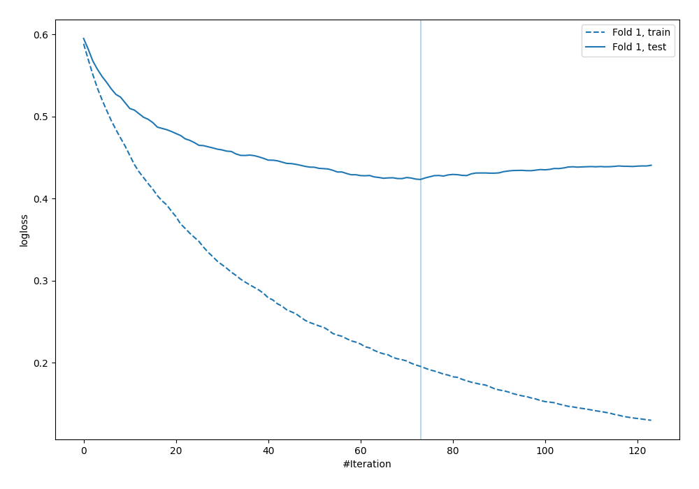
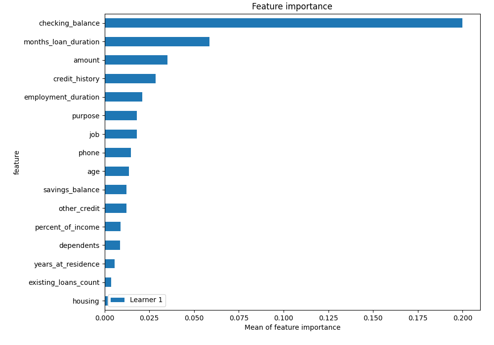
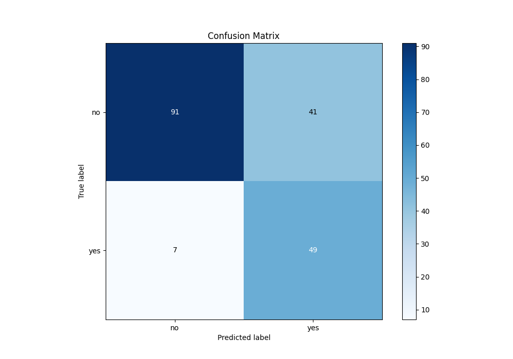
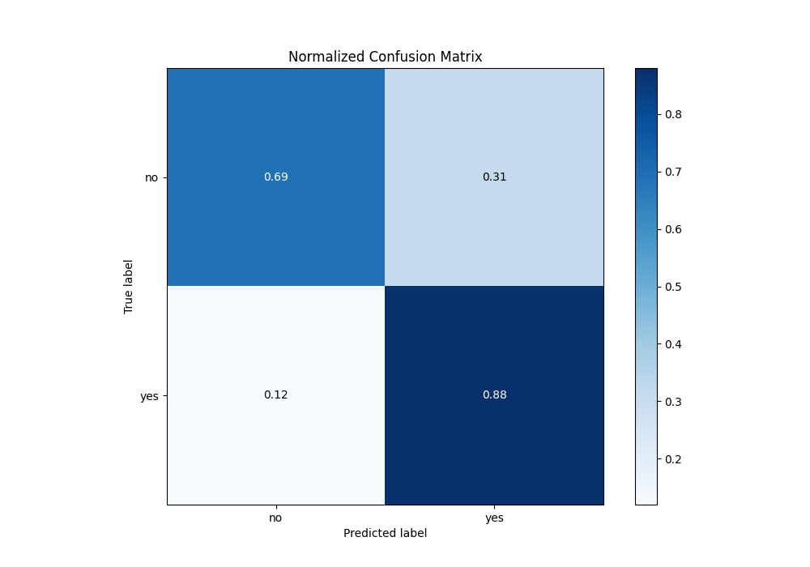
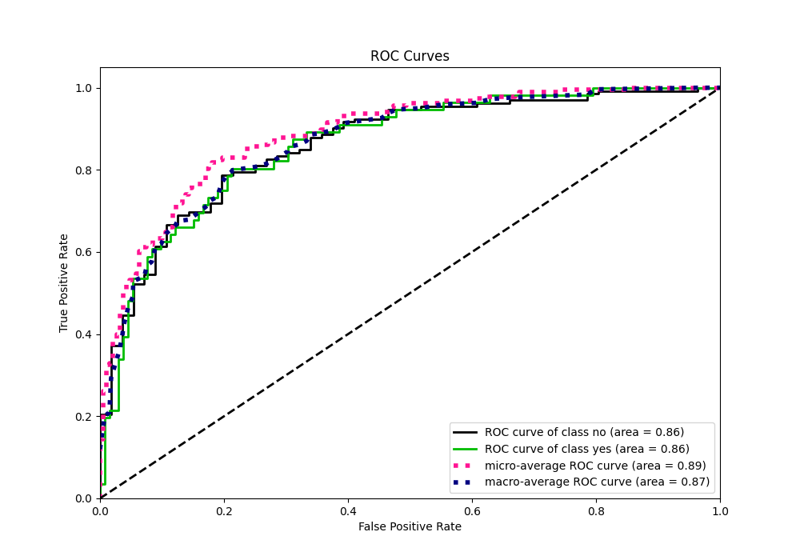
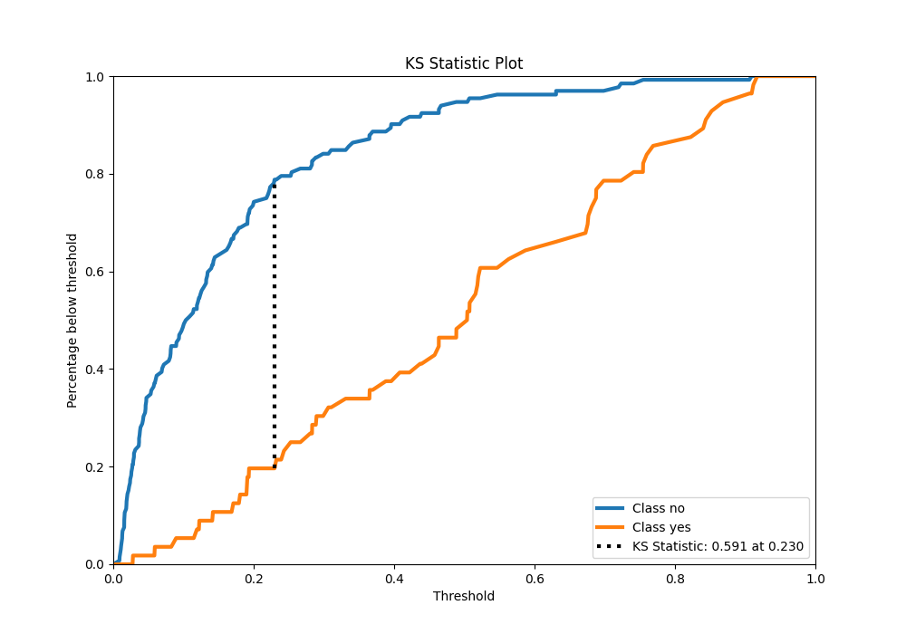
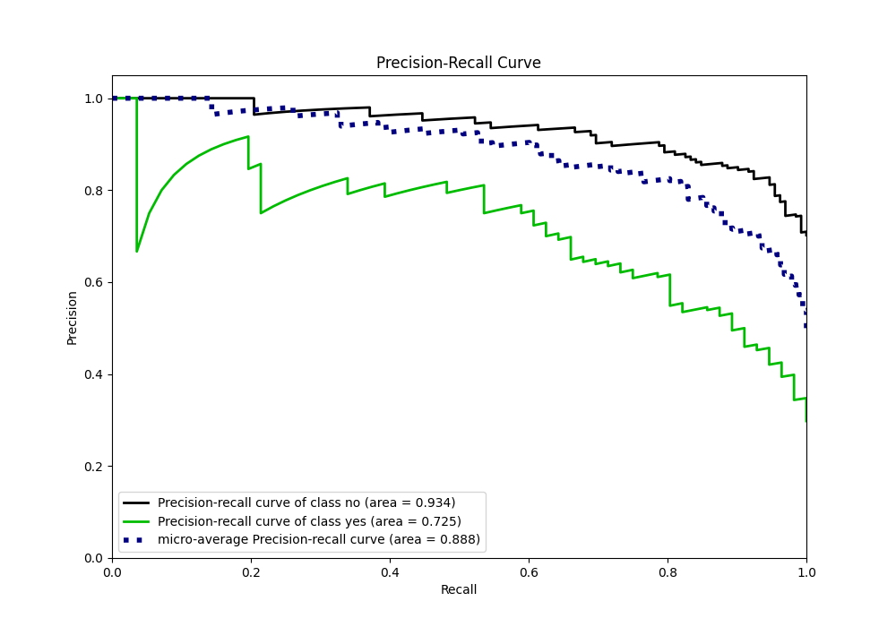
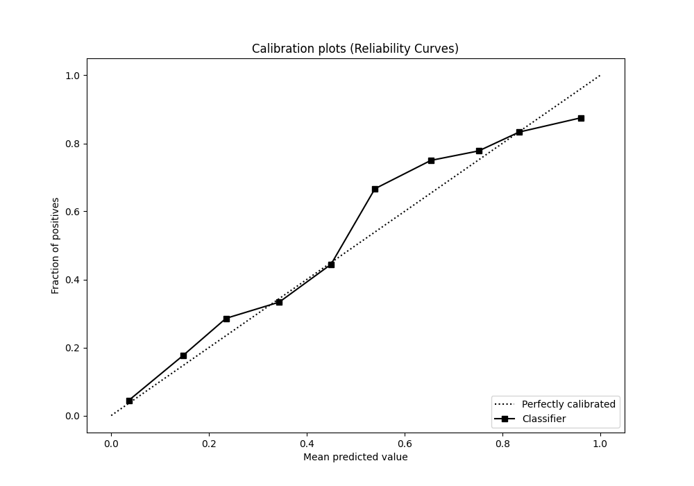
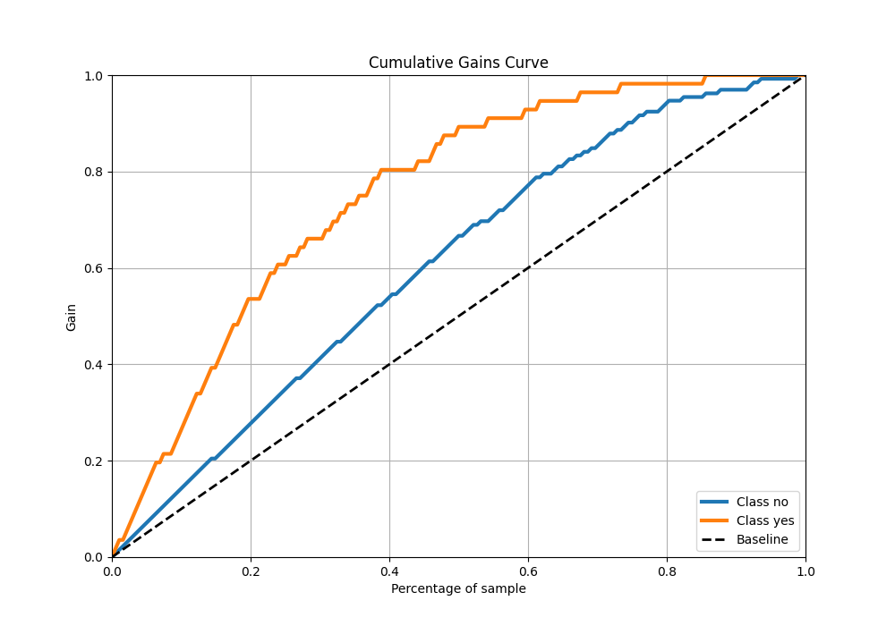
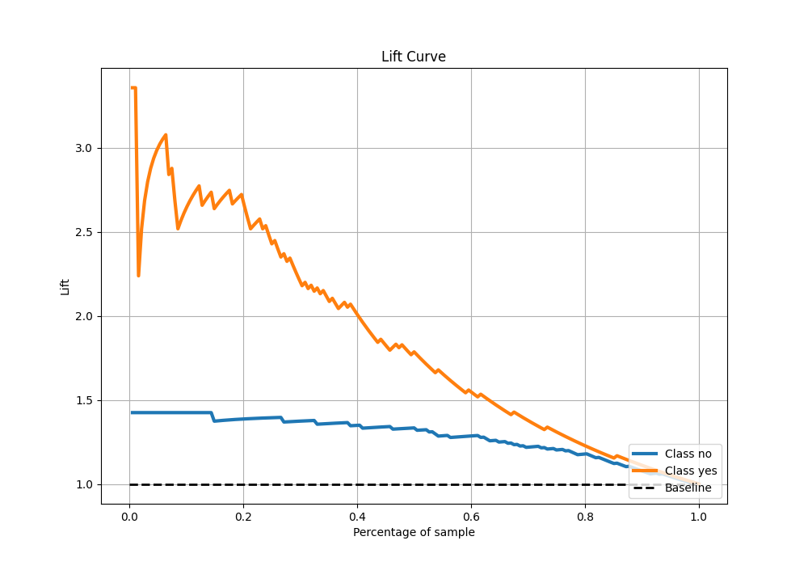

# Summary of 4_Default_Xgboost

[<< Go back](../README.md)

## Extreme Gradient Boosting (Xgboost)
- **n_jobs**: -1
- **objective**: binary:logistic
- **eta**: 0.075
- **max_depth**: 6
- **min_child_weight**: 1
- **subsample**: 1.0
- **colsample_bytree**: 1.0
- **eval_metric**: logloss
- **explain_level**: 2

## Validation
 - **validation_type**: split
 - **train_ratio**: 0.75
 - **shuffle**: True
 - **stratify**: True

## Optimized metric
logloss

## Training time

2.2 seconds

## Metric details
|           |    score |    threshold |
|:----------|---------:|-------------:|
| logloss   | 0.423275 | nan          |
| auc       | 0.862013 | nan          |
| f1        | 0.671233 |   0.179787   |
| accuracy  | 0.744681 |   0.179787   |
| precision | 0.545455 |   0.190002   |
| recall    | 1        |   0.00791558 |
| mcc       | 0.516689 |   0.179787   |

## Metric details with threshold from accuracy metric
|           |    score |   threshold |
|:----------|---------:|------------:|
| logloss   | 0.423275 |  nan        |
| auc       | 0.862013 |  nan        |
| f1        | 0.671233 |    0.179787 |
| accuracy  | 0.744681 |    0.179787 |
| precision | 0.544444 |    0.179787 |
| recall    | 0.875    |    0.179787 |
| mcc       | 0.516689 |    0.179787 |

## Confusion matrix (at threshold=0.179787)
|                |   Predicted as no |   Predicted as yes |
|:---------------|------------------:|-------------------:|
| Labeled as no  |                91 |                 41 |
| Labeled as yes |                 7 |                 49 |

## Learning curves

## Permutation-based Importance

## Confusion Matrix

## Normalized Confusion Matrix

## ROC Curve

## Kolmogorov-Smirnov Statistic

## Precision-Recall Curve

## Calibration Curve

## Cumulative Gains Curve

## Lift Curve

[<< Go back](../README.md)
