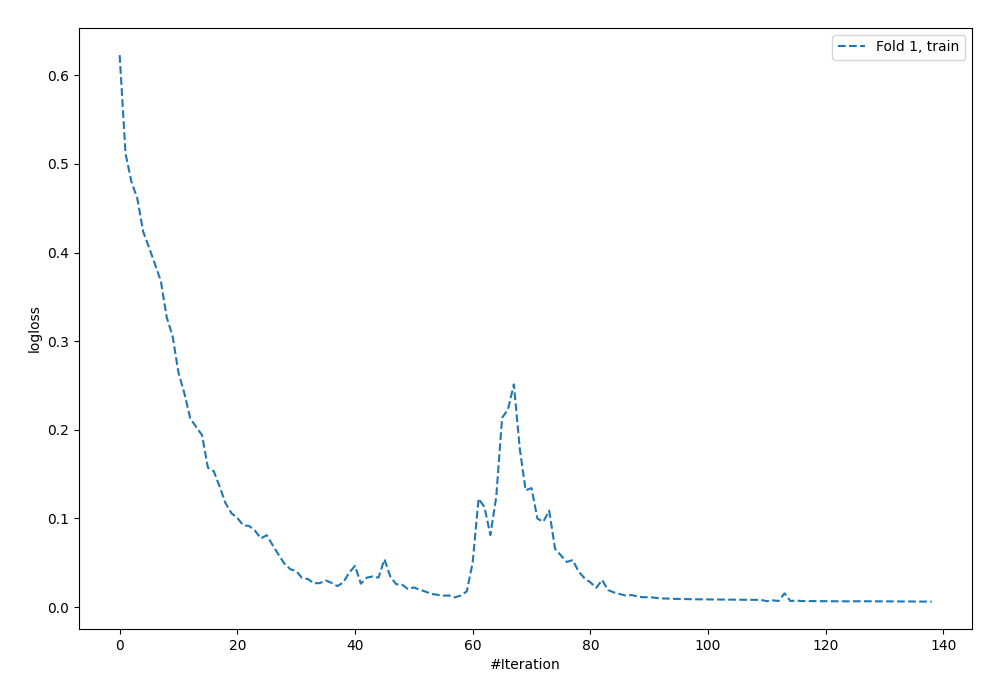
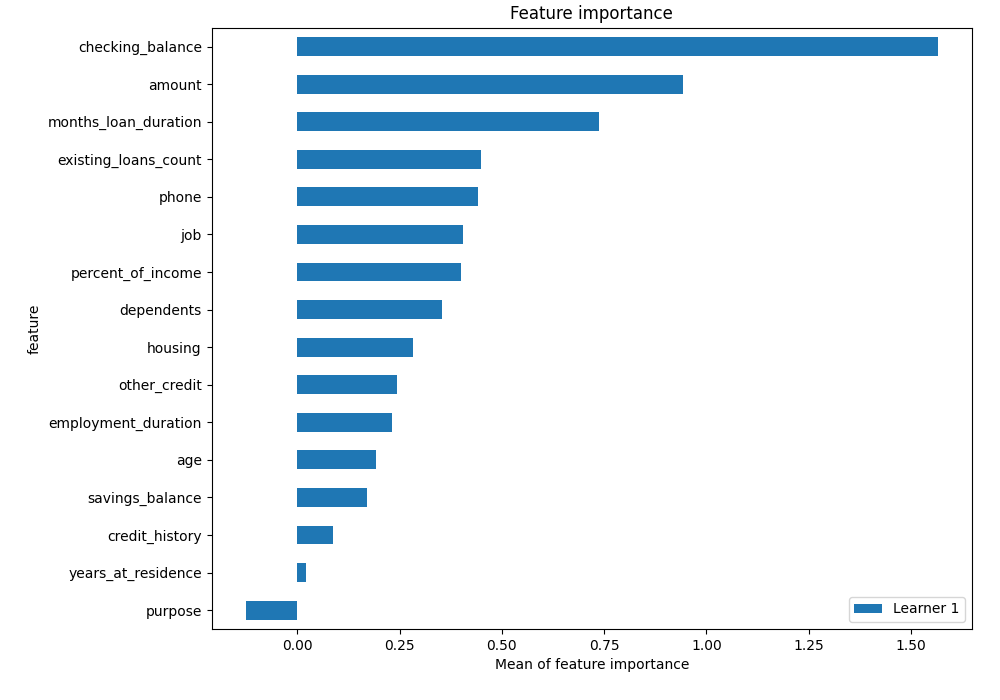
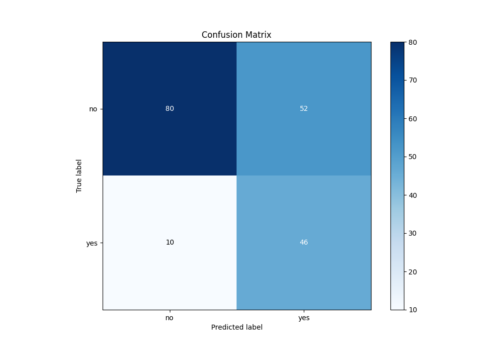
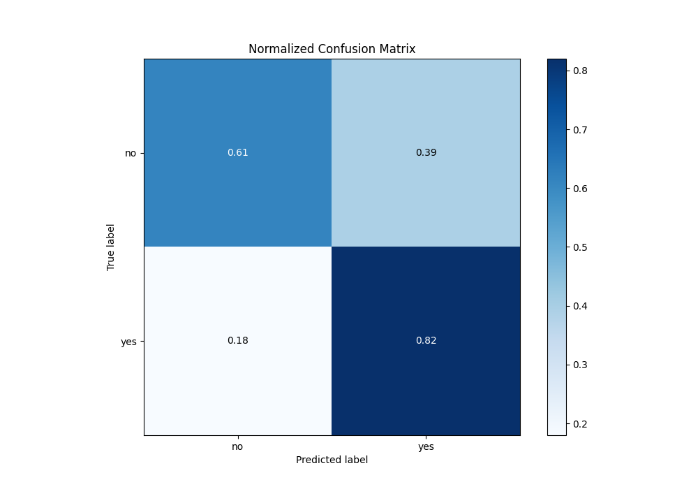
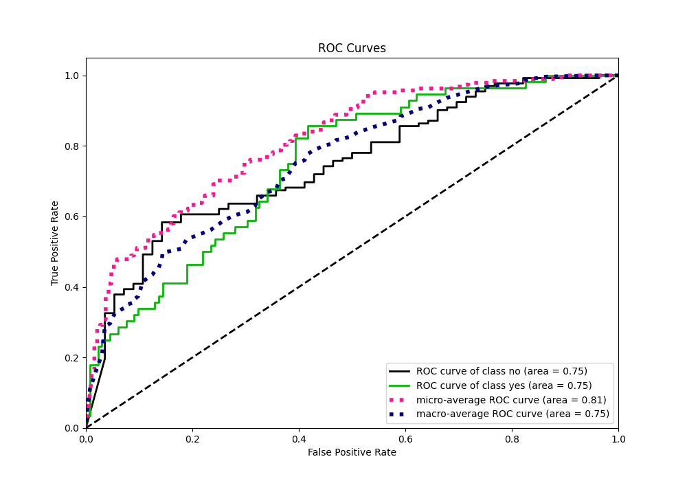
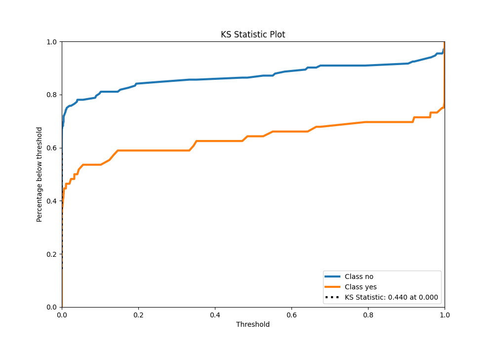
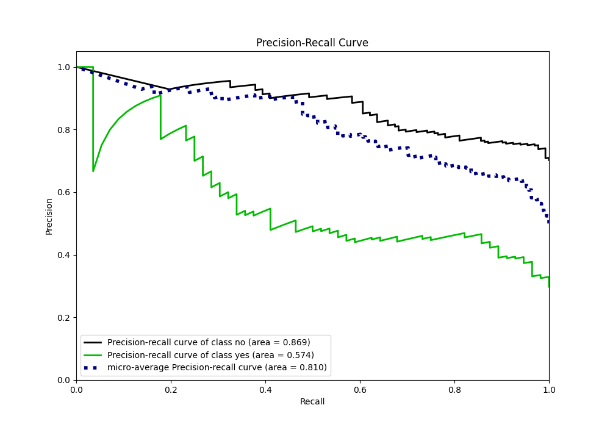
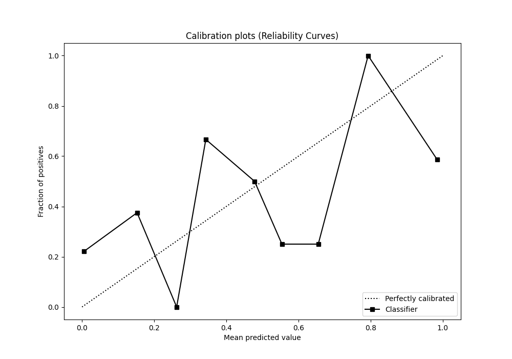
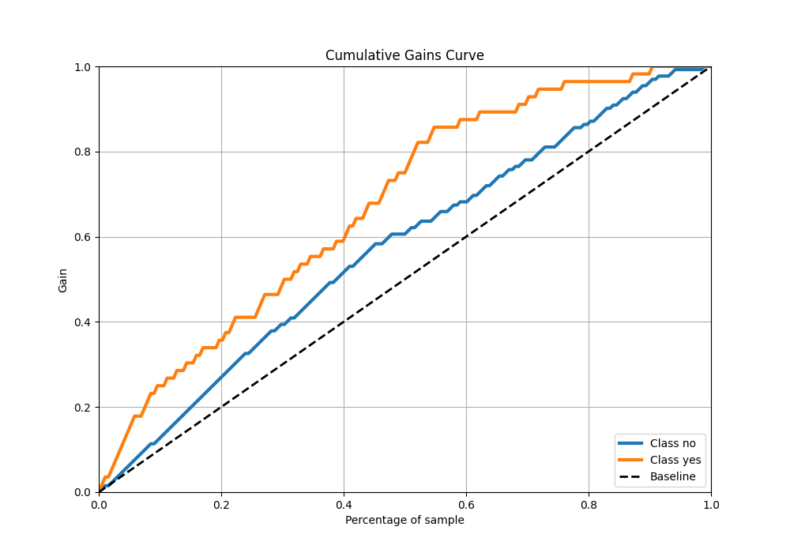
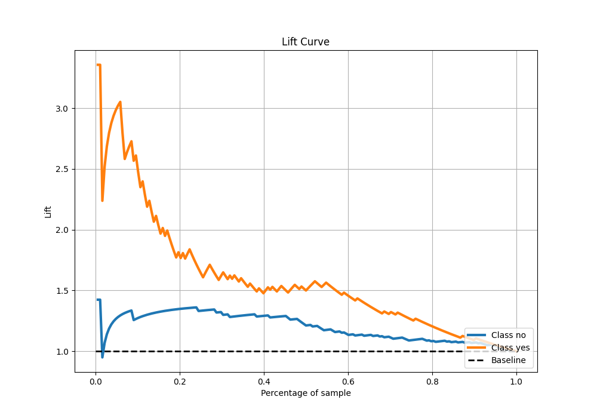

# Summary of 5_Default_NeuralNetwork

[<< Go back](../README.md)

## Neural Network
- **n_jobs**: -1
- **dense_1_size**: 32
- **dense_2_size**: 16
- **learning_rate**: 0.05
- **explain_level**: 2

## Validation
 - **validation_type**: split
 - **train_ratio**: 0.75
 - **shuffle**: True
 - **stratify**: True

## Optimized metric
logloss

## Training time

2.3 seconds

## Metric details
|           |    score |     threshold |
|:----------|---------:|--------------:|
| logloss   | 2.10423  | nan           |
| auc       | 0.748377 | nan           |
| f1        | 0.603774 |   1.04545e-06 |
| accuracy  | 0.670213 |   2.96711e-06 |
| precision | 0.469388 |   2.96711e-06 |
| recall    | 1        |   1.07105e-32 |
| mcc       | 0.404739 |   1.04545e-06 |

## Metric details with threshold from accuracy metric
|           |    score |     threshold |
|:----------|---------:|--------------:|
| logloss   | 2.10423  | nan           |
| auc       | 0.748377 | nan           |
| f1        | 0.597403 |   2.96711e-06 |
| accuracy  | 0.670213 |   2.96711e-06 |
| precision | 0.469388 |   2.96711e-06 |
| recall    | 0.821429 |   2.96711e-06 |
| mcc       | 0.391356 |   2.96711e-06 |

## Confusion matrix (at threshold=3e-06)
|                |   Predicted as no |   Predicted as yes |
|:---------------|------------------:|-------------------:|
| Labeled as no  |                80 |                 52 |
| Labeled as yes |                10 |                 46 |

## Learning curves

## Permutation-based Importance

## Confusion Matrix

## Normalized Confusion Matrix

## ROC Curve

## Kolmogorov-Smirnov Statistic

## Precision-Recall Curve

## Calibration Curve

## Cumulative Gains Curve

## Lift Curve

[<< Go back](../README.md)
