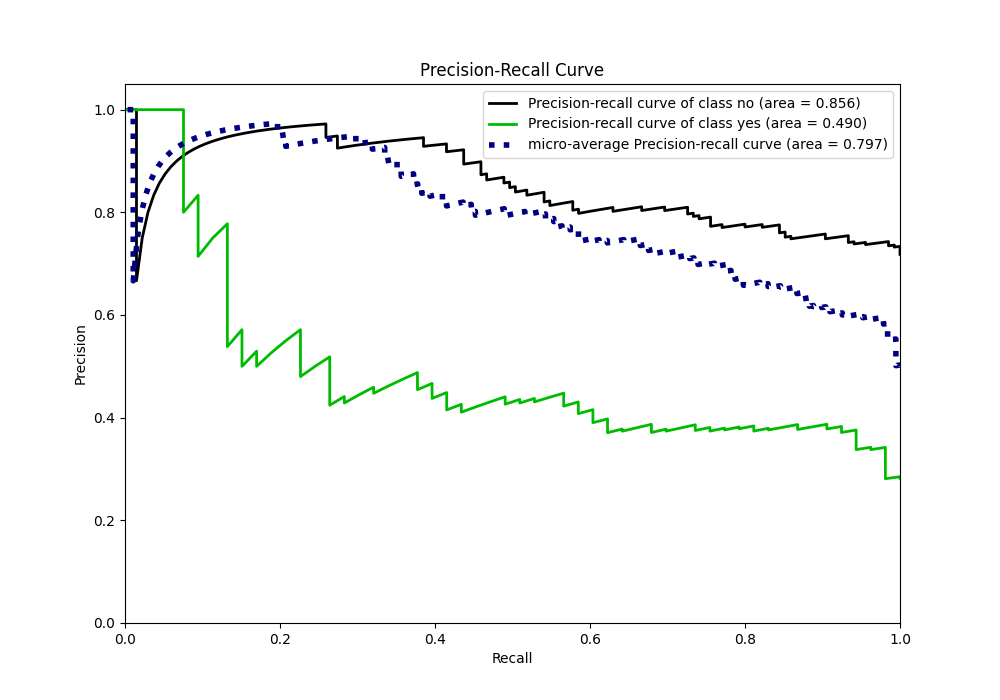
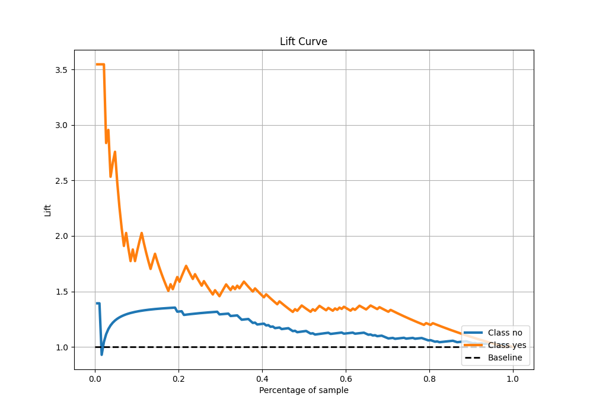
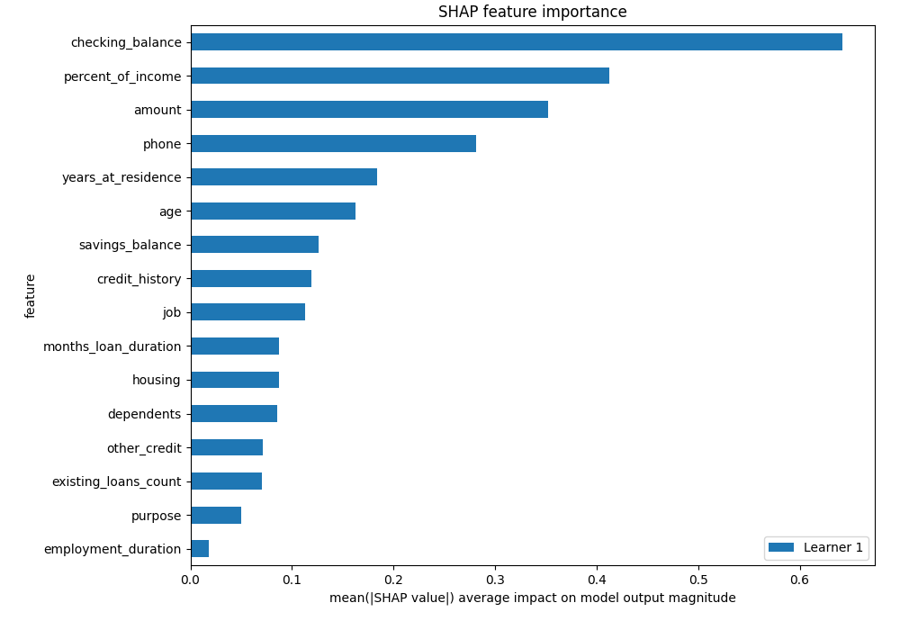
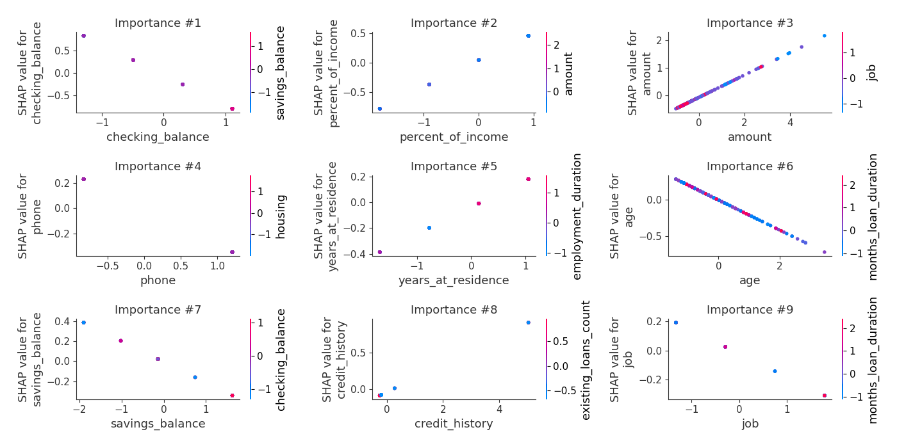

# Summary of 3_Linear

[<< Go back](../README.md)

## Logistic Regression (Linear)
- **n_jobs**: -1
- **explain_level**: 2

## Validation
 - **validation_type**: split
 - **train_ratio**: 0.75
 - **shuffle**: True
 - **stratify**: True

## Optimized metric
logloss

## Training time

4.0 seconds

## Metric details
|           |    score |   threshold |
|:----------|---------:|------------:|
| logloss   | 0.55141  | nan         |
| auc       | 0.700489 | nan         |
| f1        | 0.542373 |   0.150857  |
| accuracy  | 0.606383 |   0.234153  |
| precision | 0.387097 |   0.150857  |
| recall    | 1        |   0.0200786 |
| mcc       | 0.327539 |   0.141095  |

## Metric details with threshold from accuracy metric
|           |    score |   threshold |
|:----------|---------:|------------:|
| logloss   | 0.55141  |  nan        |
| auc       | 0.700489 |  nan        |
| f1        | 0.493151 |    0.234153 |
| accuracy  | 0.606383 |    0.234153 |
| precision | 0.387097 |    0.234153 |
| recall    | 0.679245 |    0.234153 |
| mcc       | 0.231299 |    0.234153 |

## Confusion matrix (at threshold=0.234153)
|                |   Predicted as no |   Predicted as yes |
|:---------------|------------------:|-------------------:|
| Labeled as no  |                78 |                 57 |
| Labeled as yes |                17 |                 36 |

## Learning curves

## Coefficients
| feature              |   Learner_1 |
|:---------------------|------------:|
| percent_of_income    |   0.459308  |
| amount               |   0.407879  |
| years_at_residence   |   0.205798  |
| credit_history       |   0.191308  |
| housing              |   0.143164  |
| months_loan_duration |   0.103498  |
| dependents           |   0.10124   |
| employment_duration  |   0.0215618 |
| purpose              |  -0.0511426 |
| existing_loans_count |  -0.0873068 |
| other_credit         |  -0.123574  |
| job                  |  -0.161711  |
| age                  |  -0.205097  |
| savings_balance      |  -0.206302  |
| phone                |  -0.285798  |
| checking_balance     |  -0.684245  |
| intercept            |  -1.1595    |

## Permutation-based Importance

## Confusion Matrix

## Normalized Confusion Matrix

## ROC Curve

## Kolmogorov-Smirnov Statistic

## Precision-Recall Curve

## Calibration Curve

## Cumulative Gains Curve

## Lift Curve

## SHAP Importance

## SHAP Dependence plots

### Dependence (Fold 1)

## SHAP Decision plots

### Top-10 Worst decisions for class 0 (Fold 1)

### Top-10 Best decisions for class 0 (Fold 1)

### Top-10 Worst decisions for class 1 (Fold 1)

### Top-10 Best decisions for class 1 (Fold 1)

[<< Go back](../README.md)
