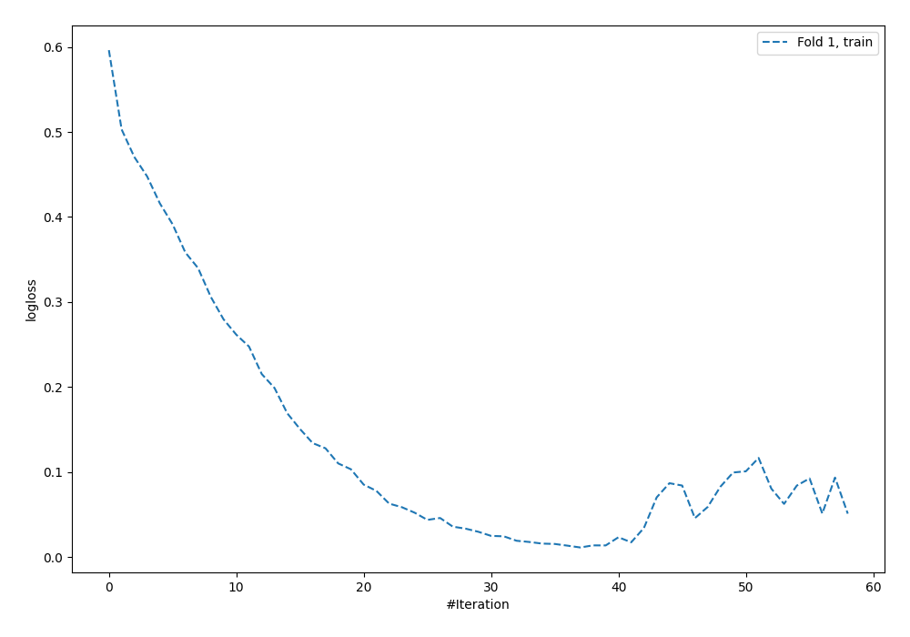
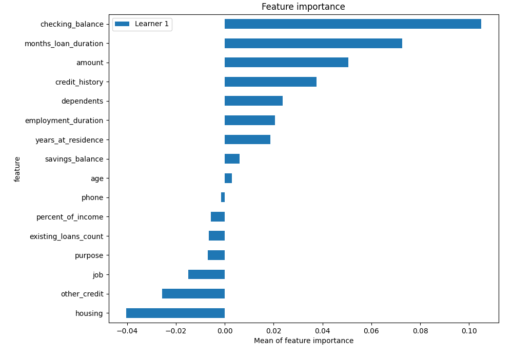
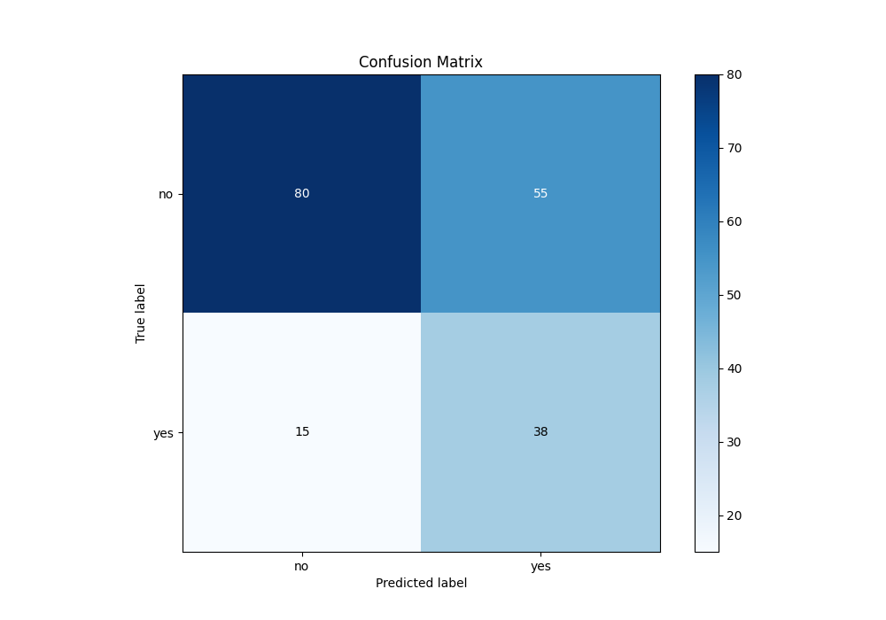
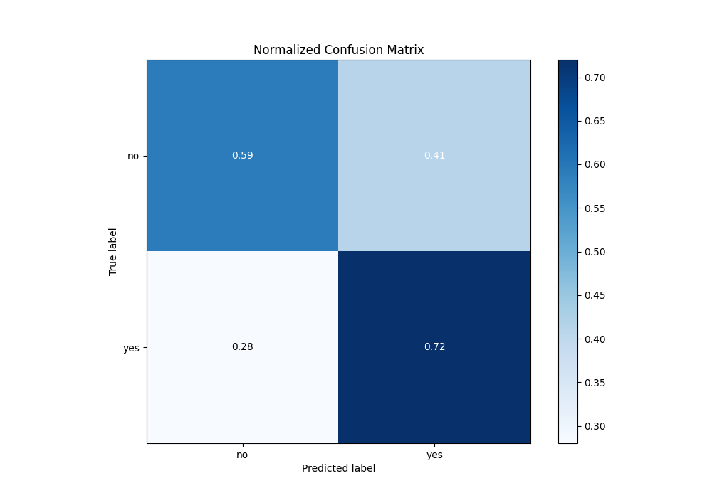
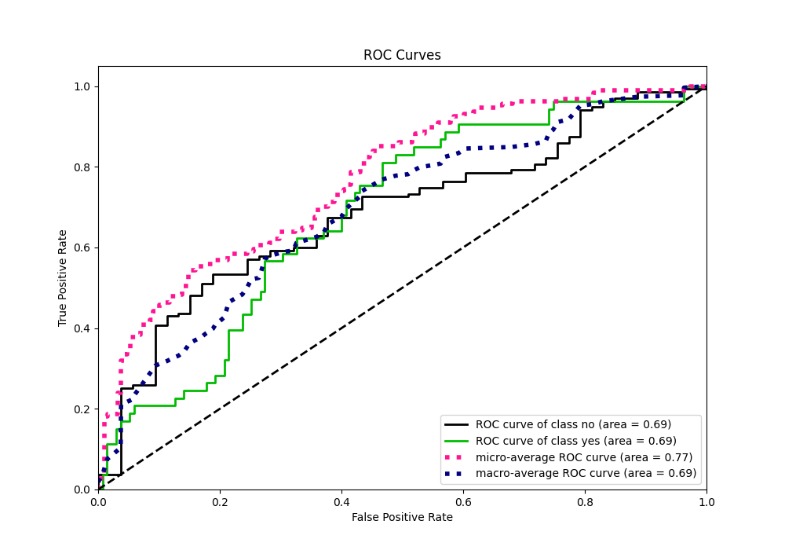
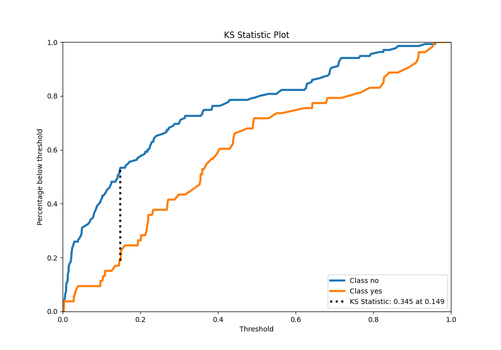
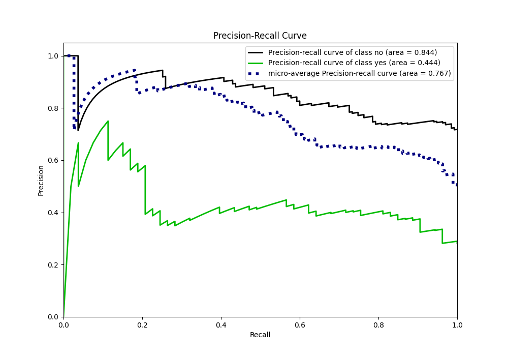
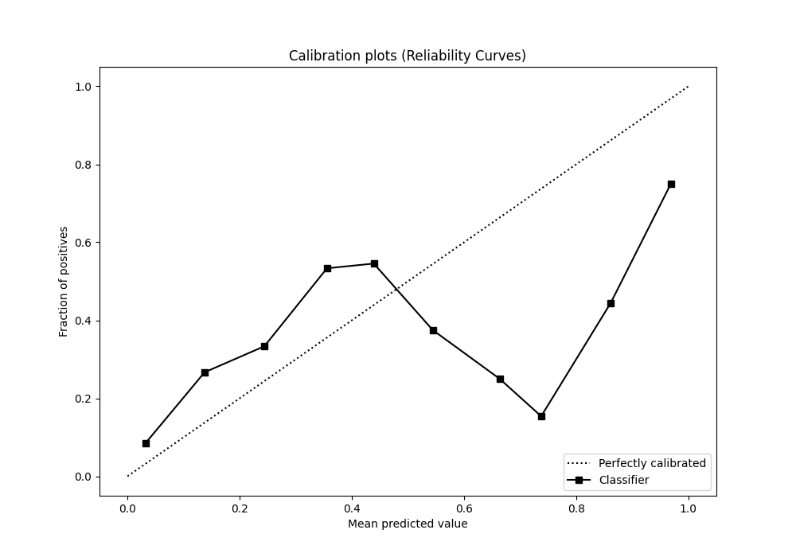
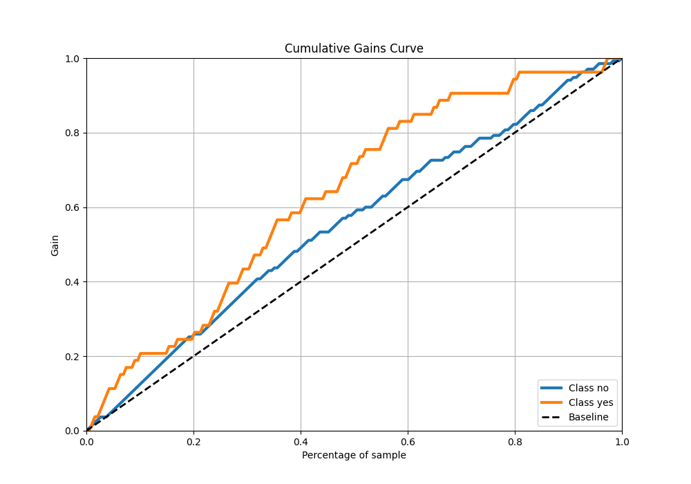
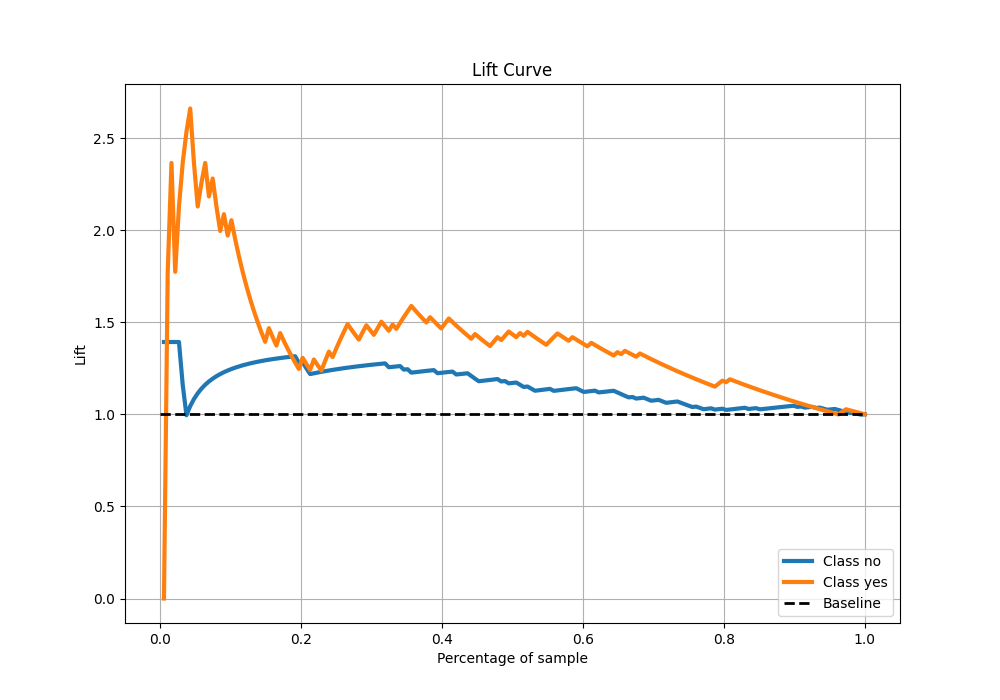

# Summary of 5_Default_NeuralNetwork

[<< Go back](../README.md)

## Neural Network
- **n_jobs**: -1
- **dense_1_size**: 32
- **dense_2_size**: 16
- **learning_rate**: 0.05
- **explain_level**: 2

## Validation
 - **validation_type**: split
 - **train_ratio**: 0.75
 - **shuffle**: True
 - **stratify**: True

## Optimized metric
logloss

## Training time

2.1 seconds

## Metric details
|           |    score |     threshold |
|:----------|---------:|--------------:|
| logloss   | 0.654245 | nan           |
| auc       | 0.686513 | nan           |
| f1        | 0.540881 |   0.149536    |
| accuracy  | 0.62766  |   0.214545    |
| precision | 0.408602 |   0.214545    |
| recall    | 1        |   0.000998424 |
| mcc       | 0.3127   |   0.149536    |

## Metric details with threshold from accuracy metric
|           |    score |   threshold |
|:----------|---------:|------------:|
| logloss   | 0.654245 |  nan        |
| auc       | 0.686513 |  nan        |
| f1        | 0.520548 |    0.214545 |
| accuracy  | 0.62766  |    0.214545 |
| precision | 0.408602 |    0.214545 |
| recall    | 0.716981 |    0.214545 |
| mcc       | 0.27859  |    0.214545 |

## Confusion matrix (at threshold=0.214545)
|                |   Predicted as no |   Predicted as yes |
|:---------------|------------------:|-------------------:|
| Labeled as no  |                80 |                 55 |
| Labeled as yes |                15 |                 38 |

## Learning curves

## Permutation-based Importance

## Confusion Matrix

## Normalized Confusion Matrix

## ROC Curve

## Kolmogorov-Smirnov Statistic

## Precision-Recall Curve

## Calibration Curve

## Cumulative Gains Curve

## Lift Curve

[<< Go back](../README.md)
