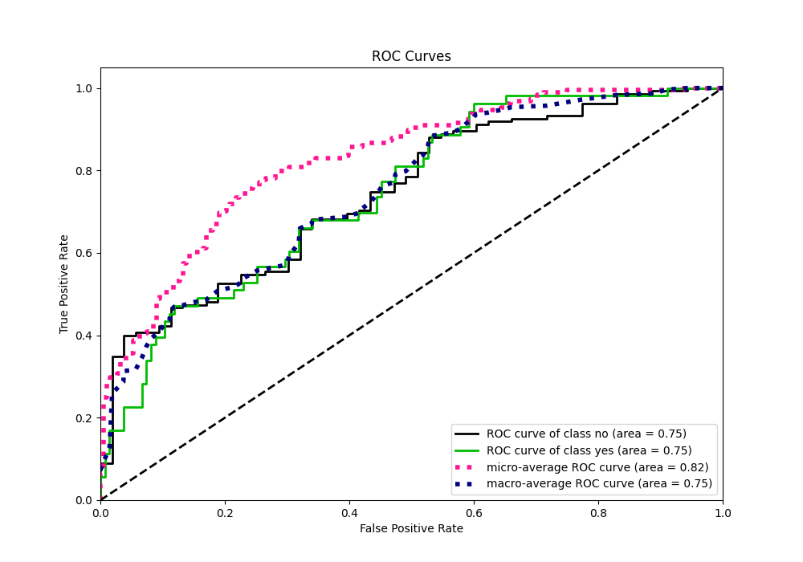
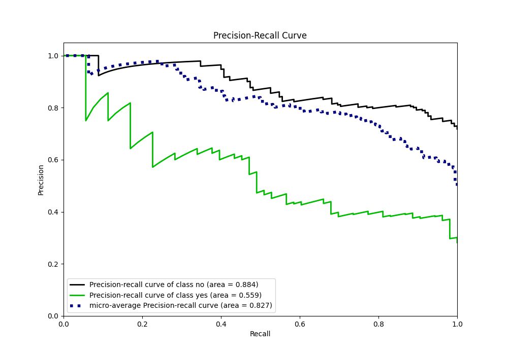

# Summary of Ensemble

[<< Go back](../README.md)

## Ensemble structure
| Model                   |   Weight |
|:------------------------|---------:|
| 3_Linear                |        1 |
| 4_Default_Xgboost       |        4 |
| 5_Default_NeuralNetwork |        1 |

## Metric details
|           |    score |   threshold |
|:----------|---------:|------------:|
| logloss   | 0.51086  | nan         |
| auc       | 0.745772 | nan         |
| f1        | 0.551351 |   0.140216  |
| accuracy  | 0.632979 |   0.261665  |
| precision | 0.409091 |   0.261665  |
| recall    | 1        |   0.0148627 |
| mcc       | 0.356409 |   0.140216  |

## Metric details with threshold from accuracy metric
|           |    score |   threshold |
|:----------|---------:|------------:|
| logloss   | 0.51086  |  nan        |
| auc       | 0.745772 |  nan        |
| f1        | 0.510638 |    0.261665 |
| accuracy  | 0.632979 |    0.261665 |
| precision | 0.409091 |    0.261665 |
| recall    | 0.679245 |    0.261665 |
| mcc       | 0.265155 |    0.261665 |

## Confusion matrix (at threshold=0.261665)
|                |   Predicted as no |   Predicted as yes |
|:---------------|------------------:|-------------------:|
| Labeled as no  |                83 |                 52 |
| Labeled as yes |                17 |                 36 |

## Learning curves

## Confusion Matrix

## Normalized Confusion Matrix

## ROC Curve

## Kolmogorov-Smirnov Statistic

## Precision-Recall Curve

## Calibration Curve

## Cumulative Gains Curve

## Lift Curve

[<< Go back](../README.md)
