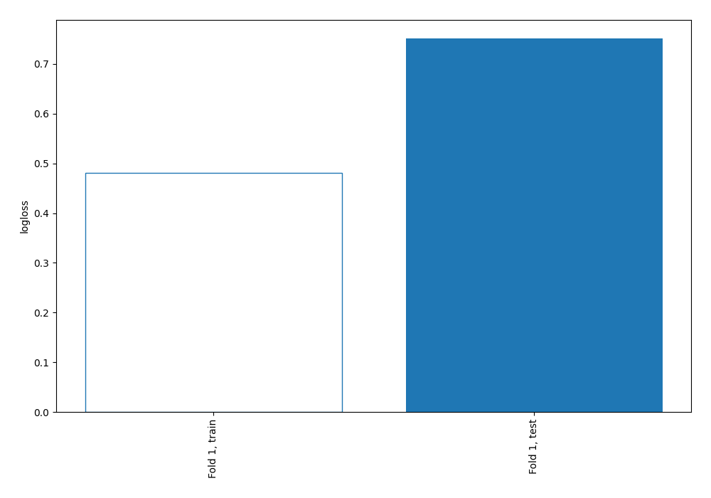
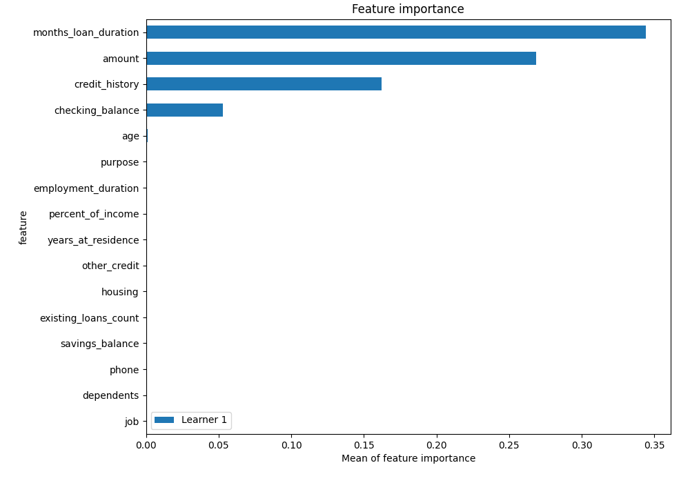
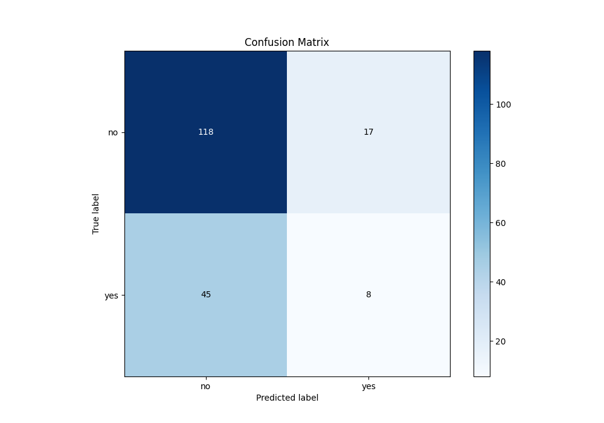
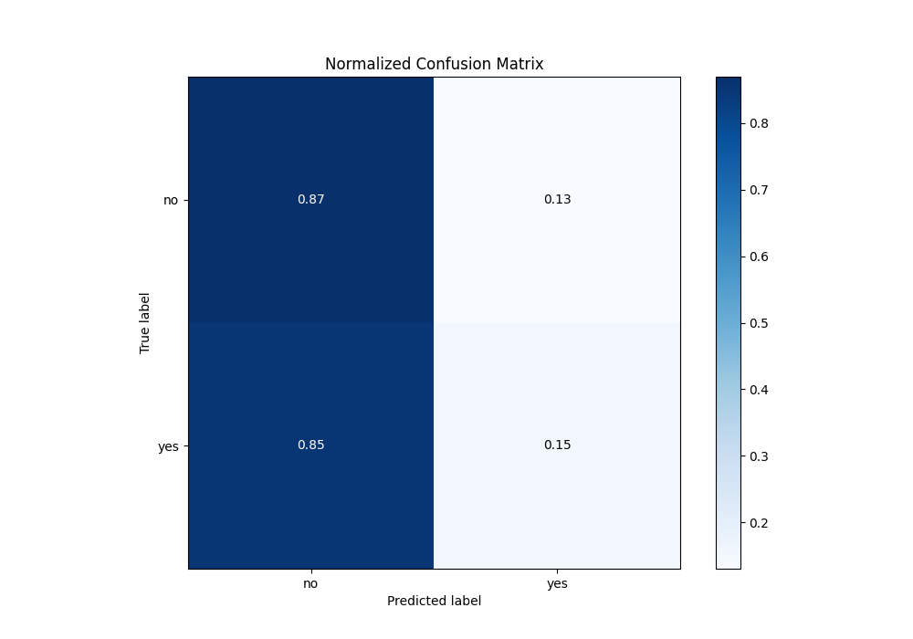
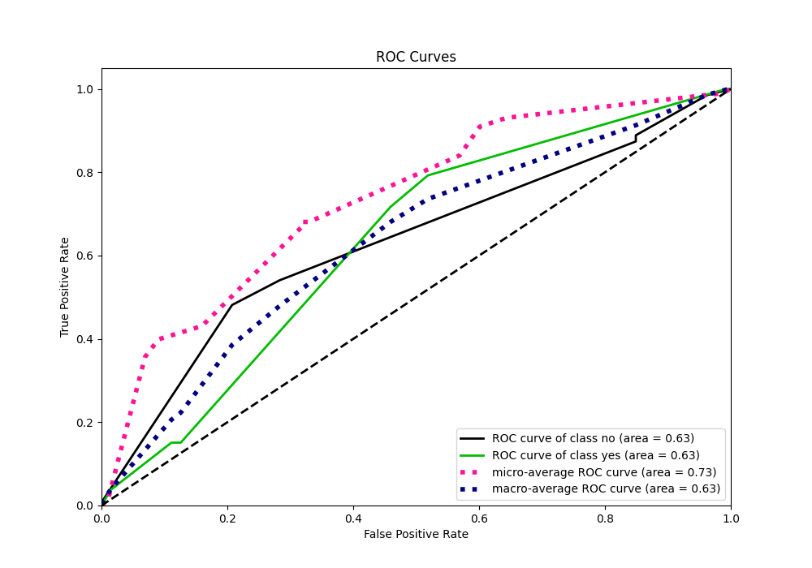
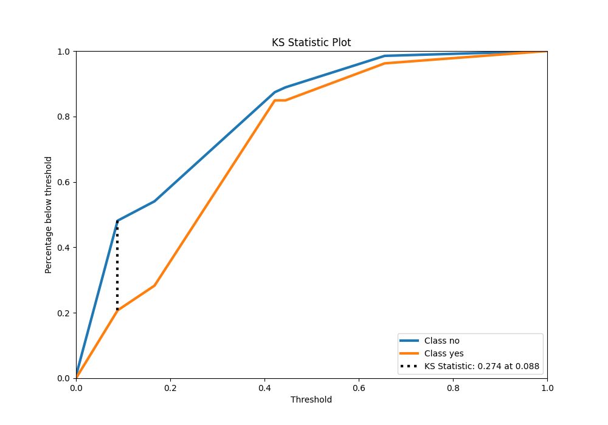
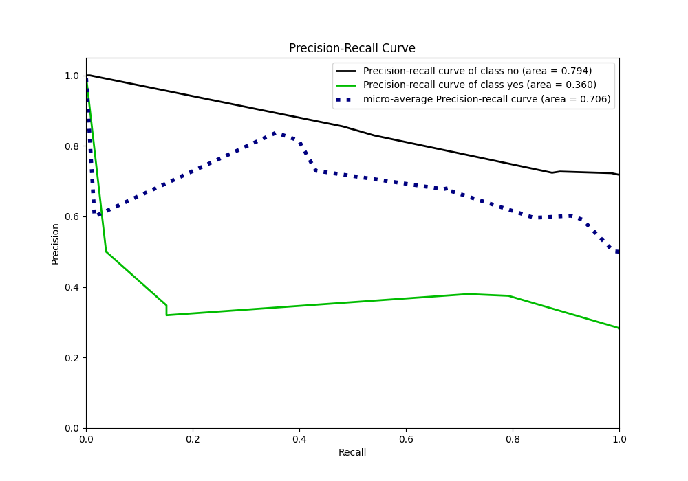
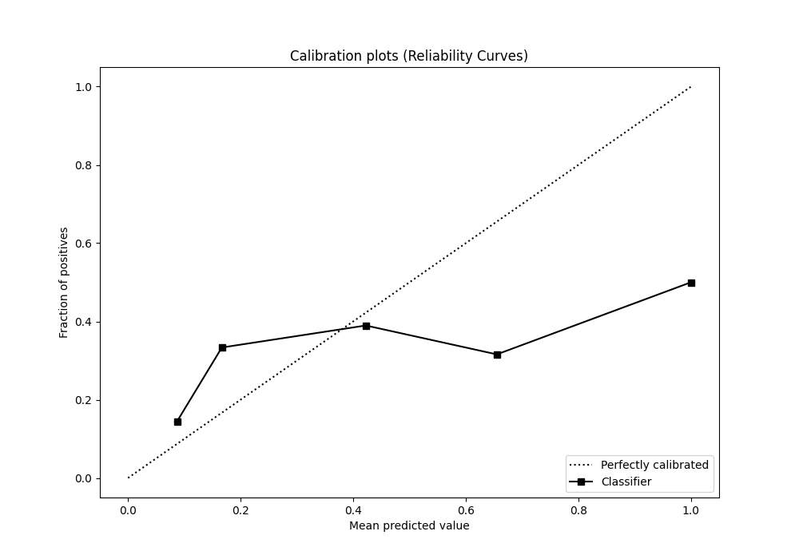
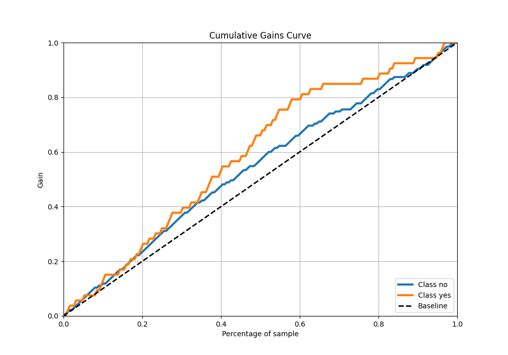
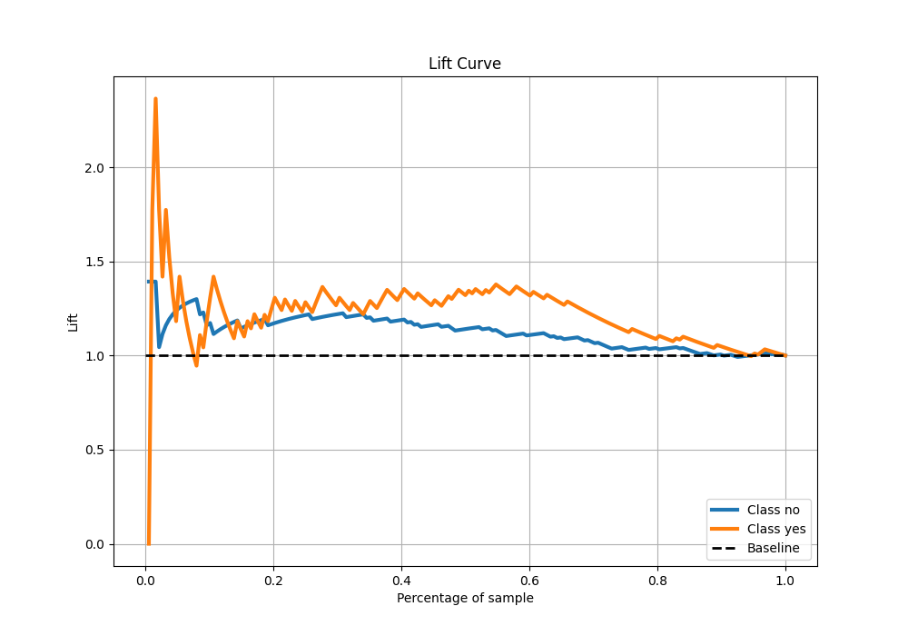

# Summary of 2_DecisionTree

[<< Go back](../README.md)

## Decision Tree
- **n_jobs**: -1
- **criterion**: gini
- **max_depth**: 3
- **explain_level**: 2

## Validation
 - **validation_type**: split
 - **train_ratio**: 0.75
 - **shuffle**: True
 - **stratify**: True

## Optimized metric
logloss

## Training time

7.2 seconds

## Metric details
|           |    score |   threshold |
|:----------|---------:|------------:|
| logloss   | 0.751196 | nan         |
| auc       | 0.633263 | nan         |
| f1        | 0.509091 |   0.0883534 |
| accuracy  | 0.670213 |   0.421875  |
| precision | 0.38     |   0.166667  |
| recall    | 1        |   0         |
| mcc       | 0.251151 |   0.0883534 |

## Metric details with threshold from accuracy metric
|           |     score |   threshold |
|:----------|----------:|------------:|
| logloss   | 0.751196  |  nan        |
| auc       | 0.633263  |  nan        |
| f1        | 0.205128  |    0.421875 |
| accuracy  | 0.670213  |    0.421875 |
| precision | 0.32      |    0.421875 |
| recall    | 0.150943  |    0.421875 |
| mcc       | 0.0331501 |    0.421875 |

## Confusion matrix (at threshold=0.421875)
|                |   Predicted as no |   Predicted as yes |
|:---------------|------------------:|-------------------:|
| Labeled as no  |               118 |                 17 |
| Labeled as yes |                45 |                  8 |

## Learning curves

## Permutation-based Importance

## Confusion Matrix

## Normalized Confusion Matrix

## ROC Curve

## Kolmogorov-Smirnov Statistic

## Precision-Recall Curve

## Calibration Curve

## Cumulative Gains Curve

## Lift Curve

[<< Go back](../README.md)
