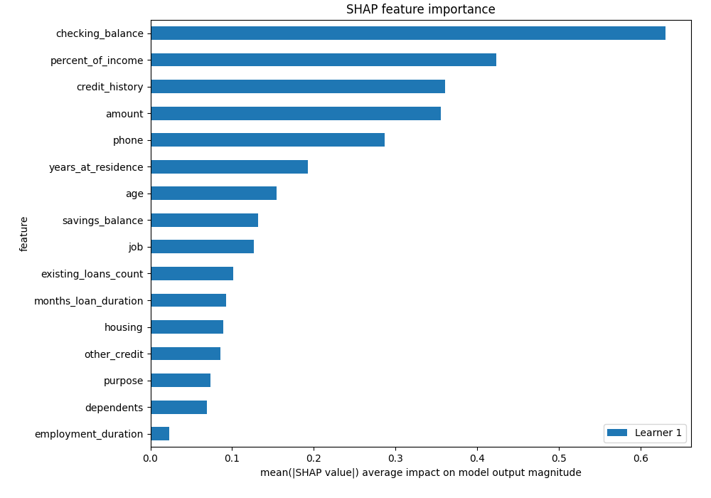

# Summary of 3_Linear

[<< Go back](../README.md)

## Logistic Regression (Linear)
- **n_jobs**: -1
- **explain_level**: 2

## Validation
 - **validation_type**: split
 - **train_ratio**: 0.75
 - **shuffle**: True
 - **stratify**: True

## Optimized metric
logloss

## Training time

4.7 seconds

## Metric details
|           |    score |    threshold |
|:----------|---------:|-------------:|
| logloss   | 0.542454 | nan          |
| auc       | 0.71153  | nan          |
| f1        | 0.558659 |   0.138033   |
| accuracy  | 0.654255 |   0.2474     |
| precision | 0.433333 |   0.2474     |
| recall    | 1        |   0.00964753 |
| mcc       | 0.364084 |   0.138033   |

## Metric details with threshold from accuracy metric
|           |    score |   threshold |
|:----------|---------:|------------:|
| logloss   | 0.542454 |    nan      |
| auc       | 0.71153  |    nan      |
| f1        | 0.545455 |      0.2474 |
| accuracy  | 0.654255 |      0.2474 |
| precision | 0.433333 |      0.2474 |
| recall    | 0.735849 |      0.2474 |
| mcc       | 0.322508 |      0.2474 |

## Confusion matrix (at threshold=0.2474)
|                |   Predicted as no |   Predicted as yes |
|:---------------|------------------:|-------------------:|
| Labeled as no  |                84 |                 51 |
| Labeled as yes |                14 |                 39 |

## Learning curves

## Coefficients
| feature              |   Learner_1 |
|:---------------------|------------:|
| percent_of_income    |   0.470849  |
| amount               |   0.411287  |
| years_at_residence   |   0.215153  |
| housing              |   0.146145  |
| existing_loans_count |   0.125948  |
| months_loan_duration |   0.109974  |
| dependents           |   0.0820967 |
| employment_duration  |   0.0273432 |
| purpose              |  -0.0755997 |
| other_credit         |  -0.148371  |
| job                  |  -0.181358  |
| age                  |  -0.195181  |
| savings_balance      |  -0.215585  |
| phone                |  -0.290984  |
| credit_history       |  -0.433241  |
| checking_balance     |  -0.671809  |
| intercept            |  -1.19721   |

## Permutation-based Importance

## Confusion Matrix

## Normalized Confusion Matrix

## ROC Curve

## Kolmogorov-Smirnov Statistic

## Precision-Recall Curve

## Calibration Curve

## Cumulative Gains Curve

## Lift Curve

## SHAP Importance

## SHAP Dependence plots

### Dependence (Fold 1)

## SHAP Decision plots

### Top-10 Worst decisions for class 0 (Fold 1)

### Top-10 Best decisions for class 0 (Fold 1)

### Top-10 Worst decisions for class 1 (Fold 1)

### Top-10 Best decisions for class 1 (Fold 1)

[<< Go back](../README.md)
