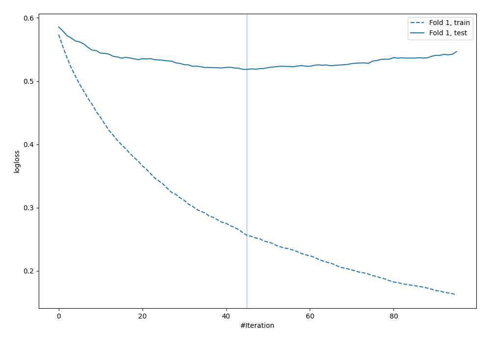
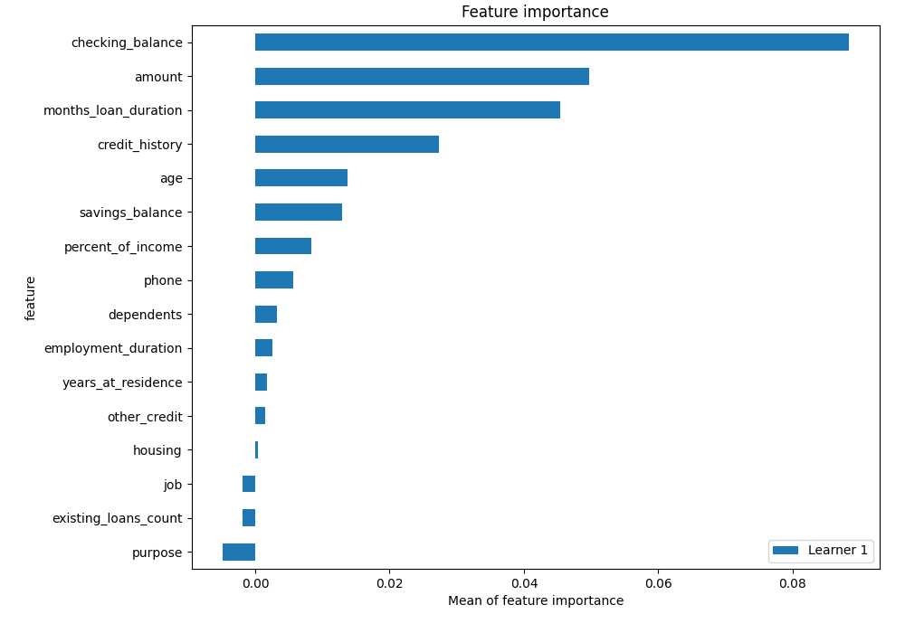
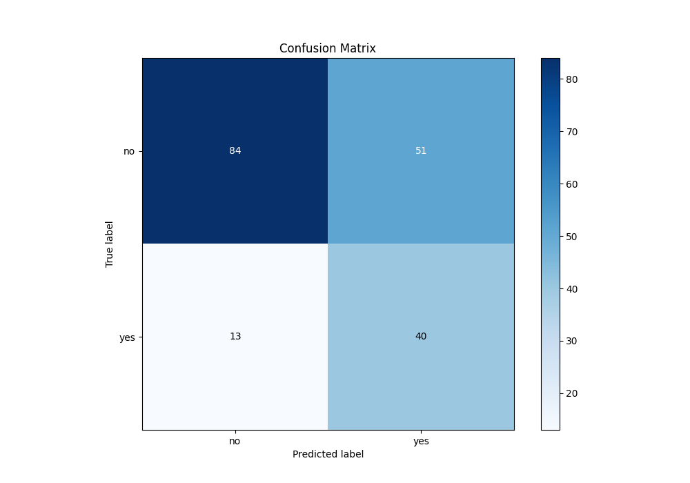
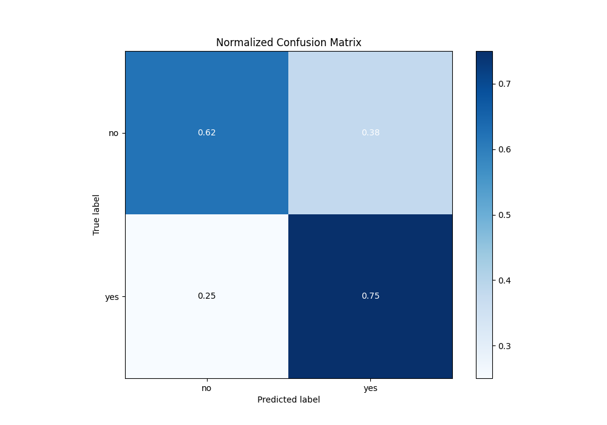
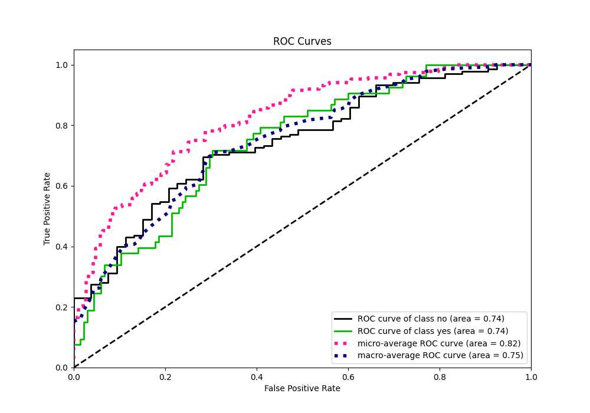
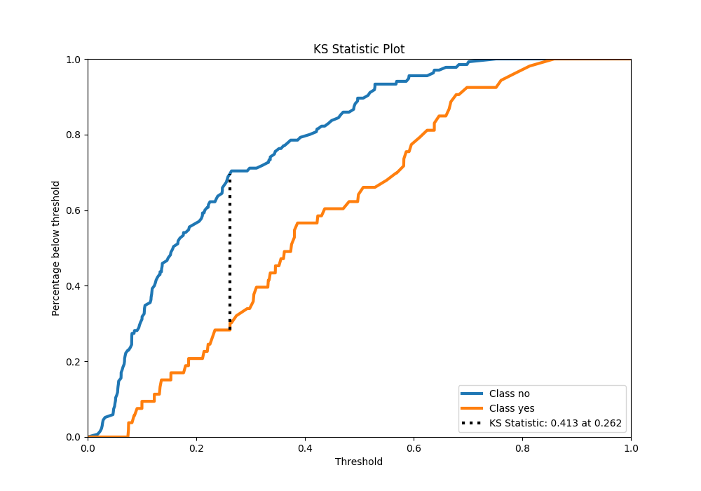
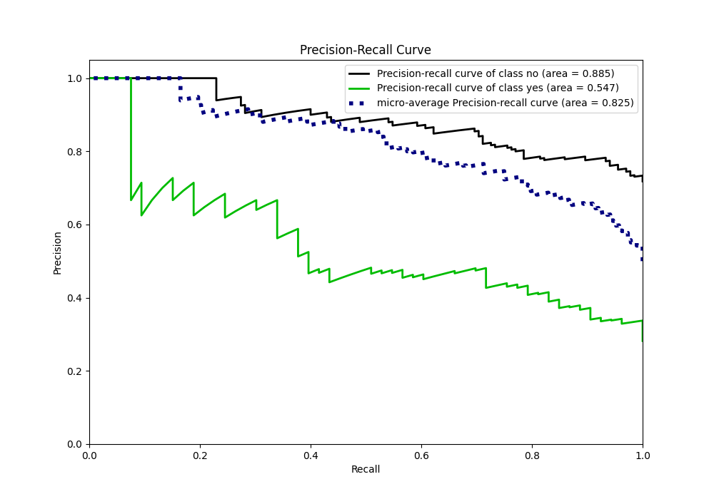
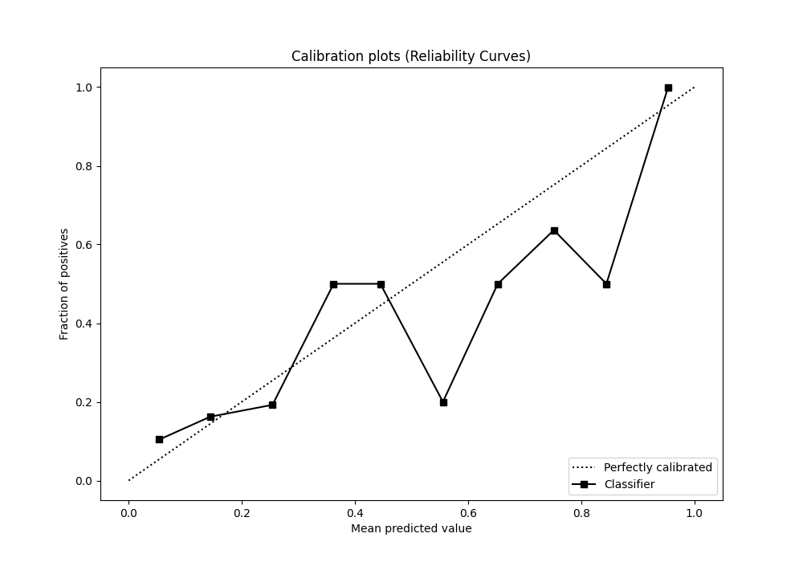
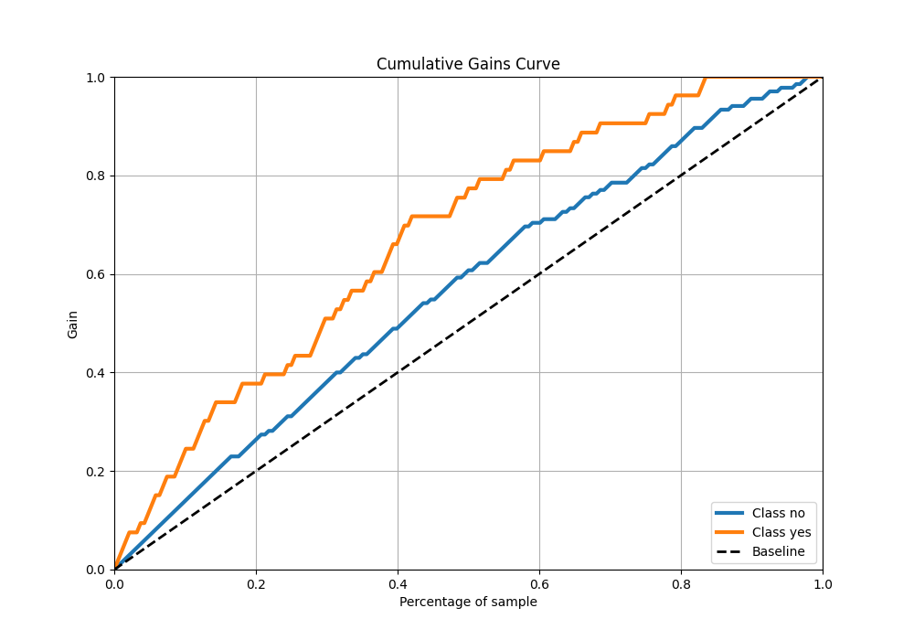
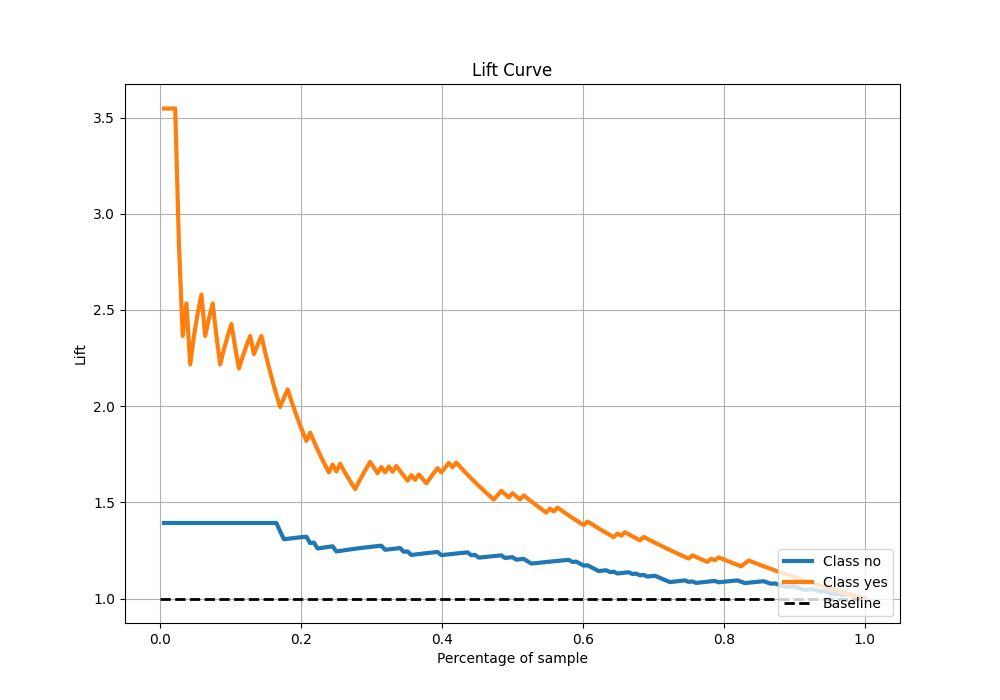

# Summary of 4_Default_Xgboost

[<< Go back](../README.md)

## Extreme Gradient Boosting (Xgboost)
- **n_jobs**: -1
- **objective**: binary:logistic
- **eta**: 0.075
- **max_depth**: 6
- **min_child_weight**: 1
- **subsample**: 1.0
- **colsample_bytree**: 1.0
- **eval_metric**: logloss
- **explain_level**: 2

## Validation
 - **validation_type**: split
 - **train_ratio**: 0.75
 - **shuffle**: True
 - **stratify**: True

## Optimized metric
logloss

## Training time

2.2 seconds

## Metric details
|           |    score |   threshold |
|:----------|---------:|------------:|
| logloss   | 0.518423 | nan         |
| auc       | 0.744235 | nan         |
| f1        | 0.56     |   0.212893  |
| accuracy  | 0.659574 |   0.227454  |
| precision | 0.43956  |   0.227454  |
| recall    | 1        |   0.0166507 |
| mcc       | 0.346665 |   0.212893  |

## Metric details with threshold from accuracy metric
|           |    score |   threshold |
|:----------|---------:|------------:|
| logloss   | 0.518423 |  nan        |
| auc       | 0.744235 |  nan        |
| f1        | 0.555556 |    0.227454 |
| accuracy  | 0.659574 |    0.227454 |
| precision | 0.43956  |    0.227454 |
| recall    | 0.754717 |    0.227454 |
| mcc       | 0.339367 |    0.227454 |

## Confusion matrix (at threshold=0.227454)
|                |   Predicted as no |   Predicted as yes |
|:---------------|------------------:|-------------------:|
| Labeled as no  |                84 |                 51 |
| Labeled as yes |                13 |                 40 |

## Learning curves

## Permutation-based Importance

## Confusion Matrix

## Normalized Confusion Matrix

## ROC Curve

## Kolmogorov-Smirnov Statistic

## Precision-Recall Curve

## Calibration Curve

## Cumulative Gains Curve

## Lift Curve

[<< Go back](../README.md)
