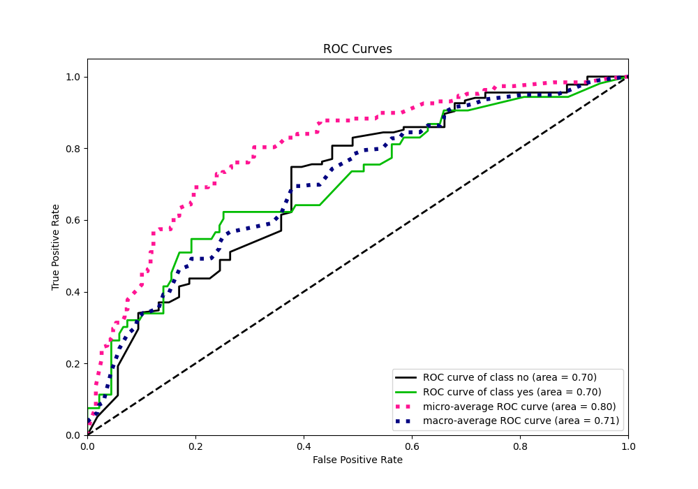

# Summary of 6_Default_RandomForest

[<< Go back](../README.md)

## Random Forest
- **n_jobs**: -1
- **criterion**: gini
- **max_features**: 0.9
- **min_samples_split**: 30
- **max_depth**: 4
- **eval_metric_name**: logloss
- **explain_level**: 2

## Validation
 - **validation_type**: split
 - **train_ratio**: 0.75
 - **shuffle**: True
 - **stratify**: True

## Optimized metric
logloss

## Training time

3.0 seconds

## Metric details
|           |    score |   threshold |
|:----------|---------:|------------:|
| logloss   | 0.551099 |  nan        |
| auc       | 0.702795 |  nan        |
| f1        | 0.505263 |    0.101759 |
| accuracy  | 0.617021 |    0.295628 |
| precision | 0.390805 |    0.295628 |
| recall    | 1        |    0.039137 |
| mcc       | 0.249346 |    0.101759 |

## Metric details with threshold from accuracy metric
|           |    score |   threshold |
|:----------|---------:|------------:|
| logloss   | 0.551099 |  nan        |
| auc       | 0.702795 |  nan        |
| f1        | 0.485714 |    0.295628 |
| accuracy  | 0.617021 |    0.295628 |
| precision | 0.390805 |    0.295628 |
| recall    | 0.641509 |    0.295628 |
| mcc       | 0.224615 |    0.295628 |

## Confusion matrix (at threshold=0.295628)
|                |   Predicted as no |   Predicted as yes |
|:---------------|------------------:|-------------------:|
| Labeled as no  |                82 |                 53 |
| Labeled as yes |                19 |                 34 |

## Learning curves

## Permutation-based Importance

## Confusion Matrix

## Normalized Confusion Matrix

## ROC Curve

## Kolmogorov-Smirnov Statistic

## Precision-Recall Curve

## Calibration Curve

## Cumulative Gains Curve

## Lift Curve

[<< Go back](../README.md)
